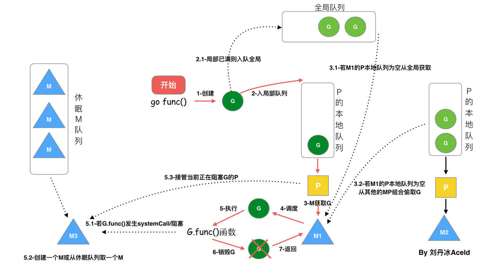

# 书籍

基础语法	《Go 语言圣经》、A Tour of Go
并发编程	《Go 并发编程实战》、GMP 调度解析1
性能优化	《深入理解 Go 语言》、GC 三色标记5
微服务架构	Kratos、Go-zero、gRPC 实践9
开源贡献	参与 Etcd、TiKV、Dtm 等项目的 Issue/PR

《Mastering Go》 https://github.com/hantmac/Mastering_Go_ZH_CN
《Concurrency in Go》 https://github.com/hapi666/GOBook/tree/master
《100 Go Mistakes and How to Avoid Them》 https://github.com/teivah/100-go-mistakes
《high-performance-go》 https://github.com/geektutu/high-performance-go
《Go语言高级编程·第二版》-2025, 豆瓣: https://book.douban.com/subject/37436371/
《Go语言定制指南》- 2022, 5.4K Star: https://github.com/chai2010/go-ast-book
《面向WebAssembly编程》- 2020, 1.4K Star: https://github.com/3dgen/cppwasm-book
《Go语言高级编程》-2019, 19.5K Star: https://github.com/chai2010/advanced-go-programming-book
《WebAssembly标准入门》- 2018: https://github.com/chai2010/wasm-book-code

《深入go语言之旅》https://go.cyub.vip/

《Golang修养之路》 https://www.yuque.com/aceld/golang/ithv8f

《幼麟实验室》https://space.bilibili.com/567195437/lists

《Go 程序员面试笔试宝典》https://github.com/golang-design/Go-Questions

《GO 夜读》https://space.bilibili.com/326749661/lists


## 博客

https://github.com/gopherchina


# Go 进阶

1. 内存逃逸
2. 垃圾回收，标记清理算法
3. 内存模型
4. goroutine调度，GMP模型
5. 性能分析pprof、go tool trace
6. dlv、gdb调试，依赖src源码

# 重点

## 一、GMP 模型核心架构

### 1. 三大核心组件

| 组件                    | 说明                       | 数量关系          |
| ----------------------- | -------------------------- | ----------------- |
| **G** (Goroutine) | 轻量级协程，初始栈2KB      | 动态创建          |
| **M** (Machine)   | 操作系统线程，真正执行单元 | 默认上限10000     |
| **P** (Processor) | 逻辑处理器，调度上下文     | 默认等于CPU核心数 |

2. 关键数据结构

```go
// runtime/runtime2.go
type g struct {
    stack       stack   // 协程栈
    sched       gobuf   // 调度上下文
    atomicstatus uint32 // 状态：_Grunnable/_Grunning等
}

type p struct {
    runq     [256]guintptr // 本地运行队列
    runnext  guintptr      // 高优先级G
    m        *m            // 绑定的M
}

type m struct {
    g0      *g       // 调度专用G
    curg    *g       // 当前运行的G
    p       puintptr // 关联的P

}
```

### 1. 工作窃取（Work Stealing）

当P的本地队列为空时：

1. 以1/61概率检查全局队列
2. 从其他P的本地队列窃取一半G
3. 确保各P负载均衡

### 2. 系统调用优化

**go**

```
// 网络轮询器（NetPoller）
func netpoll(block bool) gList {
    // 使用epoll/kqueue/IOCP等系统接口
    // 将IO就绪的G加入可运行队列
}
```

### 3. 抢占式调度实现

1. **监控线程** （sysmon）每10ms检测运行超过10ms的G
2. 向目标M发送 `SIGURG`信号
3. 信号处理函数修改G的上下文，插入调度调用



## 二、GC算法

### 1. 历程

* **Go V1.5的三色并发标记法**
* **Go V1.5的三色标记为什么需要STW**
* **Go V1.5的三色标记为什么需要屏障机制(“强-弱” 三色不变式、插入屏障、删除屏障 )**
* **Go V1.8混合写屏障机制**
* **Go V1.8混合写屏障机制的全场景分析**

## 三、TCMalloc

page->span->size Class

ThreadCache->CentralCache->PageHeap，挂着FreeList

tiny->page->mSpan->size Class(Object Size)

MCache->MCentral->MHeap，绑定在P

## 四、map

总结：演变历程一览表
时期	核心实现	主要优化/解决的问题	遗留/引入的问题
Go 1.0 ~ 1.7	经典链式哈希表	实现简单	1. 内存碎片，缓存不友好
2. 易受哈希碰撞攻击
Go 1.8 ~ 1.17	优化内存布局 + 溢出桶管理	1. Key/Value 分离（省内存，利GC）
2. 溢出桶统一管理（改善局部性）
3. 哈希种子随机化（防攻击）	并发读写 panic 信息不易调试
Go 1.18+	底层算法不变	并发检测提前：更早、更清晰地 panic，易于调试	Map 本身依然非并发安全
