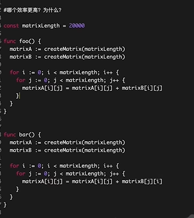

# **Go 面试题**

## **总览**

1. go，channel、锁、pprof、trace、gmp、gc、tcmalloc
2. 微服务，gin、go-zero、kitex，grpc、注册发现、限流、熔断、降级、链路追踪
3. 数据结构与算法、架构设计（4+1、3中uml图）、设计模式
4. 高性能、高并发、高可用，数据库、缓存、队列架构原理、使用与调优
5. linux、docker、git、ci/cd
6. 分布式存储系统原理，ceph、k8s、pve、kvm
7. ai工具，大模型架构、ai应用

## **BL初级**

1. make 和 new 的区别﹖
2. 了解过golang的内存管理吗?
3. 调用函数传入结构体时，应该传值还是指针﹖说出你的理由?
4. 线程有几种模型?Goroutine的原理了解过吗，讲一下实现和优势?
5. Goroutine什么时候会发生阻塞?
6. PMG模型中Goroutine有哪几种状态?
7. 每个线程/协程占用多少内存知道吗?
8. 如果Goroutine—直占用资源怎么办,PMG模型怎么解决的这个问题?
9. 如果若干线程中一个线程OOM，会发生什么?如果是Goroutine 呢?

项目中出现过OOM吗，怎么解决的?

10. 项目中错误处理是怎么做的?
11. 如果若干个Goroutine,其中有一个panic，会发生什么?
12. defer可以捕获到其Goroutine的子Goroutine 的panic吗?
13. 开发用Gin框架吗?Gin怎么做参数校验?
14. 中间件使用过吗?怎么使用的。Gin的错误处理使用过吗?Gin中自定义校验规则知道怎么做吗?自定义校验器的返回值呢?
15. golang中解析tag是怎么实现的？反射原理是什么？通过反射调用函数
16. golang的锁机制了解过吗? Mutex的锁有哪几种模式，分别介绍一下? Mutex锁底层如何实现了解过吗?
17. channel、channel使用中需要注意的地方？
18. 数据库用的什么？数据库锁有了解吗？mysql锁机制讲一下。mysql分库分表。
19. 讲一下redis分布式锁？redis主从模式和集群模式的区别了解过吗？redis的数据类型有哪些？redis持久化怎么做的？
20. 编程题：你了解的负载均衡算法有什么？实现一个负载均衡算法。

## **BL中级**

1. 自我介绍
2. 代码效率分析，考察局部性原理

3. 多核CPU场景下，cache如何保持一致、不冲突？
4. uint类型溢出
5. 介绍rune类型
6. 编程题：3个函数分别打印cat、dog、fish，要求每个函数都要起一个goroutine，按照cat、dog、fish顺序打印在屏幕上100次。
7. 介绍一下channel，无缓冲和有缓冲区别
8. 是否了解channel底层实现，比如实现channel的数据结构是什么？
9. channel是否线程安全？
10. Mutex是悲观锁还是乐观锁？悲观锁、乐观锁是什么？
11. Mutex几种模式？
12. Mutex可以做自旋锁吗？
13. 介绍一下RWMutex
14. 项目中用过的锁？
15. 介绍一下线程安全的共享内存方式
16. 介绍一下goroutine
17. goroutine自旋占用cpu如何解决（go调用、gmp）
18. 介绍linux系统信号
19. goroutine抢占时机（gc 栈扫描）
20. Gc触发时机
21. 是否了解其他gc机制
22. Go内存管理方式
23. Channel分配在栈上还是堆上？哪些对象分配在堆上，哪些对象分配在栈上？
24. 介绍一下大对象小对象，为什么小对象多了会造成gc压力？
25. 项目中遇到的oom情况？
26. 项目中使用go遇到的坑？
27. 工作遇到的难题、有挑战的事情，如何解决？
28. 如何指定指令执行顺序？

## Bs

### a. 疯狂游戏

1.将数组里的元素转化为树(里面的每个元素有一个节点i问d和父节点id)

- 2.三个goroutine 顺序打印123
  -其它(常规八股文)
  -说说项目
- go语言中数组和切片的区别
  -tcp为啥三次握手
- 三次握手和四次挥手过程
  -四次挥手的TIME_WAIT和COLSE_WAIT
- 线程和进程的区别
  锁的底层原理是什么

### b. 百度

**问:1.php°和go优缺点**
**问:2.线程，进程，协程的区别**
**问:3.GO带缓冲和不带缓冲去的chan的区别**
**问:4.Go垃圾回收机制**
**问:5.Hash表是怎么实现的**
**问:6.连接池是怎么实现的**
**问:7.TCP连接创建和关闭流程**
**问:8.浏览器输入网址，都经过哪些过程**
**问:9.linux shell top10命令**
**问:10.mysql和redis的区别和应用场景**
**问:11.编程，有序数组去掉重复**

### C. 卓拙科技

第一轮是答题，要求写的特别详细，3个小时做完的。后续有三次机会改正问题，问题会很详细的告知，体验很好。
第二轮是技术面，问了几个问题，比较有侧重点，好久没写go了，答的不是很好。
第三轮是HR面，问题都比较专业，HR小姐姐态度很棒，同时会有一个项目组leader在旁边回答疑问。

### d. 深信服

自我介绍介绍一下goroutine?
协程相比于线程的优势?

- channel说一下?
  -是不是并发安全?
  是异步还是同步?
  -go语言的数据结构?
  -map的底层说一下?
- map查找的过程?
  底层是哈希表实现的?
  -数组和切片的区别?
  -C++也可以随便问些?
  -多态是怎么实现的?

-C++的内存管理?
-完全二叉树和满二叉树的区别?
-了解红黑树吗?

- B树和B+树的区别?
  -遍历范围?
- 叶子结点是双链表连接的了解跳表吗?
  -解决map冲突的方式?
  -两种方式以上?
  -介绍一下三次握手的全过程?
- 这过程中传输了哪些信息?
- 两次握手可以吗?
  -为什么需要三次?

 解决map冲突的方式?
两种方式以上?
-介绍一下三次握手的全过程?
-这过程中传输了哪些信息?
两次握手可以吗?
-为什么需要三次?
-TCP和UDP的区别?为什么TCP是可靠的?

- 拥塞控制是解决网络拥塞还是服务器拥塞?
  -介绍一下拥塞控制?
  快重传和快恢复算法题:找出链表的倒数第k个节点

### d. 特博艾斯

1、存储过程有什么优缺点?

- 2、sql做过哪些优化，临时表优化有哪些方式，join小表关联大表的顺序?
- 3、索引如何建立，为什么要有主键索引，联合索引和关联索引区别，建立外键的好处?
  4、B树和B+树区别，可以手绘下?
- 5、redis有哪些数据类型，通常用于什么场景:string可以存储json，hash也可以存储json，有什么区别?(其实string类型就多个序列化过程)
- 6、redis过期清理策略，默认使用哪种方式?
  -7、python和nodejs区别，golang和.net区别?
- 8、谈一谈go里的切片，在一个函数里对切片进行修改会影响到原来的值?
  -9、无缓冲和有缓冲通道区别?

10、使用channel有什么注意事项，也就是什么时候会panic，如果重复关闭会怎样?

- 11、协程怎样使用，定义完就可以不管了吗，如何阻塞协程，为什么最后要用await，在gin框架里本身会阻塞，那在其他地方使用协程还需要使用await吗，在协程里还需要做什么工作吗，比如超时处理?(需不需要await就看最后是否要做收尾工作)
- 12、go里的垃圾回收机制，nodejs里的垃圾回收机制，垃圾回收主要回收栈上还是堆栈的?
  13、内存逃逸机制?
- 14、docker常用的一些命令，为什么要做目录映射，从本地拷贝一个文件到容器使用什么命令?
- 15、kafka的优缺点，topic是什么，怎么存储的:partition是什么，为什么要分区，replication是什么?
- 16、go里的互斥锁和读写锁区别，mysql里有哪些锁，乐观锁和悲观锁区别?

### e. bilibili

分布式锁的实现方式
kafka消息队列相关
http和https的区别
死锁的产生，如何处理
sync.map实现原理
context的作用、类别
sync.waitgroup用法
Go垃圾回收
用户表条目过多，查询减慢，如何处理
设计一个排行榜系统，积分高优先，同积分先达到的优先
将数组中的非零元素提到前面，保证顺序不变(简单双指针，一次遍历)

### f. 安克创新

3、数据库优化?
4、什么时候索引会失效?
5、GMP模型中全局G和P的作用?
6、gin支持路由正则?
7、http请求是如何匹配到后端服务?
8、路由映射表是什么数据结构?
9、http属于七层协议中哪一层?
10、http链接证书交换以后会做什么?
11、有看过go的一些源码?
12、切片实现原理?底层数据结构
13、切片是固定2倍扩容?
14、讲讲go的三个优点?
15、有看过那些专业书籍和感受?
16、过往工作中比较难的点，给你带来了什么提升?

### z. 收集

1.说一下go的select

2.slice和数组有什么区别
3.重复关闭channel 会怎样?向已关闭的channel 写数据会怎样?从已关闭的channel读数据会怎样?

# **企业**

## **UMU**

2026.02.25 线上1，20分钟，没问简历，N

1. 自我介绍，技能、项目情况
   回：名字，从事golang技术栈的研发，在数据库一体机、分布式系统、物联网平台积累了较多经验，近几年xx负责核心数据库一体机、备份恢复产品的后端架构设计与核心模块开发。
   技术上，对golang主要的底层原理、数据库、分布式高可用架构有较丰富的理解，熟悉中间件的架构，对大型系统有较多从0-1的完整开发与设计经验。
   项目上，我主导了三款数据库核心产品的研发，数据库一体机(IO))、极速恢复平台（RPO、RTO）、多元数据库承载平台（多元、IO、全国产）。GMP细节，调度策略
2. GM(全局锁竞争、开销)->GMP（用户协程、OS线程、逻辑处理器）。
   无锁本地队列（优先级、256、一半），全局有锁队列（61次一个、<=128）、入队出队、go func、空闲P偷取一半、阻塞M让出P寻找空闲M。
3. Slice底层、扩容原理
   len、cap、数组指针，扩容：2倍->1024  +=oldcap1/4，1.18版本后 2倍-> 256  +=(oldcap+256*3)/4，最后内存对齐。需预分配容量，copy()截取
   内存对齐是硬件和操作系统层面的要求，它要求数据的起始地址是其自身大小的整数倍，以提升CPU访问效率。
4. 操作系统进程、线程、协程的区别，进程的状态转换（就绪、运行、等待）
   资源上：os资源分配（页表刷新、G、管道），os调度单元（不需刷新、M、共享内存锁），用户线程栈上（少量寄存器，K，通信/锁）
5. 接口QPS限流设计，单人/单接口在1秒时间窗口内限制并发为1000
   令牌桶算法：now.Sub(lastT)->token+=delta->token-=n->n<=burst->ok
   漏桶限流匀速保护数据库
6. Mysql 优化，索引的成本，如何查看索引是否命中
   explain: type、extra、raw，创建联合索引，使用覆盖索引减少回表，表结构优化;读写分离、缓存、分库分表
   告警业务：api->时间埋点->mysql->慢日志->时间SQL-> explain sql -> 索引/失效->逐步优化->数值效果，业务分库分表
7. 在项目中遇到的问题/技术调研、如何解决进行分享
   a. 写入etcd报错->iowait高->message中mvvc报错->etcd集群io磁盘，raft->根据业务分层，核心存储用etcd，硬件信息用redis缓存->存储架构下封装grpc中间件
   b. 数据库长事务/阻塞事件->日志写入报错->message io timeout/failed->对比存储日志->检查坏盘->踢盘/调整connect参数
8. 对新工作的规划
   云原生、数据库/存储上深耕，AI Agent
9. 对公司有什么想了解的

   ┌─────────────────────────────────────────────────────────────────┐
   │                     面试流程中的提问策略                         │
   ├─────────────────────────────────────────────────────────────────┤
   │                                                                 │
   │  一面（技术同事）    二面（技术Leader）    三面（总监/HR）      │
   │       │                    │                    │              │
   │       ▼                    ▼                    ▼              │
   │  问技术细节          问架构方向           问团队/业务/发展       │
   │  问日常工作          问技术挑战           问公司战略            │
   │  问代码规范          问成长路径           问文化氛围            │
   │                                                                 │
   └─────────────────────────────────────────────────────────────────┘

## 字

2026.03.26 线上1，30+30分钟，问简历，N

1. 自我介绍，技能、项目情况，我看你说做一体机和备份恢复，然后你介绍一下一体机大概是主要做哪些内容呢？
   名字。go语言技术栈，数据库一体机和分布式系统经验。go底层原理、存算分离分布式系统、高可用架构有较丰富的理解。中间件，大型系统从0-1的经验。
   项目上，核心项目的特点。
   产品定位（1句） → 核心功能（3-4点） → 我的角色（1句） → 技术亮点（2-3点） → 业务价值（1句）
   软硬解耦，三大部分全冗余分布式oracle高性能一体机。分布式、高性能、易运维。后端go，微服务架构层、存储池、NVMe-OF落地。数百家金融、政府机构核心系统转型支撑。
2. 你说存算分离，能大概介绍一下你们整个的 IO 链路吗？你们计算是直接用的 Oracle 的吗？还是自研的？
   写入：计算oracle写入数据->NVMe-OF到存储->写入NVME盘，ASM冗余副本（RDMA复制）
   oracle 集群，原生官网的。公司有基于pg自研的mogdb，一体机也支持。
3. 然后你们存算分离 RDMA 主要解决什么样的问题？你们的架构是从一开始就选择了 RDMA 吗？还是遇到了问题才引入了 RDMA？
   iops低、延迟高、cpu消耗。ISCSI->SPR->NVMe-OF，客户市场高性能需求
4. 你入职的时候是还没有使用 RDMA 还是已经是现在这套架构了？与体系相关的
   ISCSI->SPR->NVMe-OF，入职后研发NVMe-OF
5. 那你觉得你这个工作的复杂点或者是难点在哪？能具体介绍一下刚刚你说的这个问题吗？比如说 I/O hang，或者是其他方面？
   计算-网络-存储-硬盘，存算分离环节的复杂性。
   数据库长事务/阻塞事件->日志写入报错->message io timeout/failed/reset->对比存储日志->检查坏盘->踢盘/调整connect keepalive参数
   ROCe交换机PFC、ECN未生效，ip a->网卡丢包查询->内部复现，重置丢包数->几天观察调整交换机参数->询问厂商支持
6. 存储链路的网络问题 hang 住了，和协议层的关系是什么？你对外包装了一个无线重试的接口，还是说你会把存储只要不返回就返回。对外给卷或者是快设备或者文件系统，你是怎么做的？超时？
   不会无线重试，快速失败优先。故障iohang 超过30s->配置nvme connect+nvme_core重连->效果30s->10s内
7. 我看你还说你做了备份恢复，相关的事情，大概的流程是怎么样，支持哪些数据库？
   RPO秒级+RTO分钟级。oracle: socket备数据文件、实时redo、验证库、快照副本，mysql: xtrab数据文件、实时binlog、快照。ZFS 快照+压缩。
8. Oracle 的备份恢复是怎么实现的？MySQL 的备份恢复流程是怎样的？mysql 备份过程中的主要原理(xtrabackup、引擎)
   RPO秒级+RTO分钟
9. MySQL 内部的话是怎么用到这个数据文件，并且是怎么去恢复的？
   全备+增备->定时xtrab备份redo log->进行prepare后可恢复->一致性快照->binlog日志
10. 这个备份恢复在线上运行的时候，最大的库是多大的容量？几个 T 的那个文件的备份延迟和带宽是多少呢？就如果我要做一个完整的备份，不是增量备份，要做多久？
    几十、几百TB，磁盘带宽约500M/s、1ms，按公式计算几小时-十几小时
11. 整个备份链路上的瓶颈点在哪？你说带宽是说本地 IO 磁盘带宽，还是上传到远端的带宽？
    本地备份链路：远端读取->网络传输->zfs目标端写入。有压缩需耗CPU、盘io性能
    异地恢复/容灾：本地 ZFS 读取→ 网络 → 远端 ZFS映射。网络带宽、网络延迟、挂载点盘io
12. 你们的远端存储选的是什么？你这个备份服务器会同时服务多少个数据库啊？是单点吗？
    一个备份服务器备份数十套数据库。单机版本地/映射，集群版本ceph存储管理卷，映射到备份服务器。zfs可设置磁盘冗余。
13. 然后你相当于意思就把远端存储挂在这台机器上。然后走这个机器做一层转发。它的机器的作用是什么？为什么不是直接写远端呀？比如把这个云盘挂到那个数据节点的某个目录下，不就直接可以用了？为什么需要一个备份服务器？
    作用：ZFS数据管理、计算-存储分离、压缩、快照、一致性校验、统一调度。RTO分钟级目标
    远端云盘：性能影响、资源争抢、IO阻塞、管理复杂
14. 你做备份这块的话，看起来主要在做存储IO 级以下是吧？
    不止是，企业级备份系统的完整设计，从存储io到计算、调度、容灾策略的完整链路
15. 就是像 SQL 引擎协议那块，你们会直接运维吗？还是有其他的 DBA 在搞？比如说存储引擎或者是SQL优化器，或者是，这就简单说就是 MySQL 上层的逻辑。你们会接触吗？
    存储引擎是需要了解的。备份的事务、redo和binlog、锁、主从复制GTID、InnoDB数据文件结构。SQL优化器备份时没有涉及到。
16. 你们的操作单元核心还是基于工具和文件在做，对吧？
    底层基座是这样。不过备份系统还有上层的抽象，断点续传，数据文件校验、策略调度分层
17. 快照你主要做的是什么效果的快照？ROW？ZFS 文件系统
    row重定向写，新位置数据指针，性能下降少，占用一些空间
18. Golang 的话如何去终止一个 Golang 的 Go routine 啊？ 具体会怎么写呢？
    chan/context，go fun(){for{select{case <-ctx.Done())}}}}}（）
19. Golang 里面的像空结构体和 interface。 有什么区别？
    struct{} 类型，面向对象组合，0字节，信号发送；interface{} 抽象接口，任意类型16字节
20. Channel 的内部数据结构是什么样？
    无缓冲ch同步阻塞，有缓冲ch异步有容量/有数据时非阻塞，关闭/发送/接收-nil/close/not close
    核心是hchan，通过环形缓冲区buf存储数据，双向链表等待sendq/recvq管理阻塞的goroutine，通过互斥锁mutex保证并发安全。无缓冲时直接用双向链表传递数据，有缓冲时先用环形队形。
    发送时->等待recvq队列->若无，检查缓冲是否满。接收时->等待sendq队列->若无，检查缓冲是否空
21. 你那边有没有接触过像 K8S 呀这种云原生的技术啊？
    有短时间接触过operator/csi，k8s申明式API、调谐循环、星形架构、Pod调度、Inform、Watch、Reconcile、组件职责，csi pv/pvc/storageclass 认证、节点、卷。
22. 那你接触过的话，你觉得他为什么要设计调谐这个概念？他有什么收益？他从软件开发这个层面上，他到底是解决什么问题？
    分布式系统状态不确定，用声明式API向期望收敛，故障自愈，弹性伸缩。简化代码、提升可测试性，承认不可靠用调谐替代一次性命令，目标驱动
23. 你能够介绍一下就是你们管控的核心架构吗？就比如说你们的服务，你们的逻辑服务是怎么部署的？你们的接口或者是你们的 Meta 数据是怎么存储的？产品技术架构讲解
    分层架构：客户端->网关层nginx、gateway(代理、鉴权、用户、流量管控)、微服务层（监控、存储、计算）->存储层，根据业务核心存etcd、redis、mysql
    高频的用grpc，对外的用http
24. 你们创一个数据库的，是那个应用或者实例，创一个库的话，你们的资源管理是怎么分配的？
    创建动作集成paas平台，存储池->卷->NVMe-OF->计算->块设备、文件系统格式化->pass平台用户、目录->互信->选择存储
25. 你刚刚说这个管控的话，有容灾机制是什么样的呢？就是比如说机器故障或者是机房故障，是怎么治愈的？或者怎么处理？HA 是怎么做啊？
    Proxmox HA 基于ceph新节点接管、看门狗(硬件计数)信号故障重启机器
26. 你自己做的一次技术选型和决策，然后大概的过程是怎么样的？推进这个语言重构的事是吧？
    lvm->zfs，lvm cow，zfs row、压缩、一致性检查、数据、快照速度
    写入etcd报错->iowait高->message中mvvc报错->etcd集群io磁盘，raft->根据业务分层，核心存储用etcd，硬件信息用redis缓存->存储架构下封装grpc中间件
27. 你那你在那边带人吗？概几个人团队？
    有过2-3，校招，新入职，产品熟悉技术路线。
28. 做个代码题：写个LRU缓存，put/get没调用要随着时间x过期
29. 对公司有什么想了解的

## 泛

2026.04.09 线上1，42分钟，问简历
1.我们今天主要聊一下技术方面的东西，你看方便先做个自我介绍吗？
名字+技术栈+擅长业务+核心项目优势

2.数据库一体机你在这里边是个什么？做哪些东西？
微服务系统设计、全模块go开发、python->go、压测POC

3.一体机它就有那个数据库的，数据库方面，然后也有后端的存储。你说的是偏偏更上面的，还是更偏下面的？
存储端，存储池、卷管理、横向扩展、NVMe-OF高性能、计算端多路径

4.数据库**的话**是用的开源的还是商业的？还有或者自研的？
计算用的oracle ，支持新创全国产化演进，也支持自研的mogdb

5.做的主要是管理层面的，是吧？
存储端，NVMe-OF高性能，数据库管理、告警监控、巡检、一键日志

6.有涉及到数据库高可用的东西吗？分布式的架构

mysql、oracle 高可用架构原理

7.你如果要做一个集群的话，这个集群是怎么做的？你这有涉及到吗？

文件系统、块设备、网络、互信、ASM

8.有一个核心的，就是说故障切换方面的，因为作为高可用来讲的话，主要就是说在故障的场景，然后集群仍然能够提供服务。

9.你是说通过VIP来做的吗？

10.在你的工作中有实际涉及到数据库高可用这一块的方案，比如说方案设计或者是对应的功能开发之类东西吗？

mysql主从架构，日志同步原理

11.你是负主要负责和存储对接的吗？

存储池、映射协议

12.存储这边作为数据库来讲，那你可能就是 Nvme over RDMA 这样的一个连接，对吧？通过这样来挂载一个块设备。
高性能RDMA

13.这里边的多路径是怎么做呢？DM他这样性能不大好啊
dm->原生多路径

14.原生多路径是你这做的吗？对 RDMA 技术有了解吗
optimize，/sys下控制器设置一些参数。绕过内核加速相同与网卡直连，高性能低延迟

15.有做过RDMA方面的开发吗？RDMA有几种连接方式啊？

16.比如说里边的那个 WQECQRC 这些概念有了解吗？
17.就没有去做它协议相关的东西，管理的那个 NVM over RD made那种发现，是吧？存储端的target，然后是那东西吗？
18.解决过在这个上面遇到的比较有难度的问题吗？能够具体说具体一点吗？当时遇到的问题是什么？然后是怎么去发现问题原因的？然后具体是怎么修改的？
数据库下io，阻塞会话->message io error->存储端存储链路闪断->硬件故障，error/固件日志
调nvme connet keepalive参数进行解决

19.可以具体到某一个问题吗？不是说一类问题，它具体发生的现象，然后是怎么找到的问题的原因，然后又是怎么去做的相应的修改，具体到某一个，就是具体的一个问题。
20.然后就把网络恢复了，就恢复了？
nvme connect 重连参数，不能无线重试会阻塞数据库业务
21.那这些参数去调它总得有个依据，为什么会需要那样去调**参数**呢？他这个参数有效果的原理是怎么样的呢？
产品规格要求，数据库业务场景
22.keepalive是谁和谁？keepalive 为什么调它会有效果？它是RDMA连接的keepalive吗？
rdma存储网络连接两端
23在这个里边你们会去做一些可观测性方面的一个系统性的东西吗？可观测性
prometheus、grafana
24. 普罗米修斯会去采集哪些东西呢？会涉及到IO性能方面的监控吗？
IO延迟过高、硬盘离线，数据源->exporter->prometheus->altermanager->webhook->告警落库->推送
25.你做过存储相关的压测，是吧？
fio/vdbench，数据库业务sysbench、benchmark
26. 会去分析具体的问题吗？就比如说有具体的。其实在你那不涉及是吧？因为直接测的是存储，然后内部的数据库的话也是相当于是外部的或者是开源的
oracle数据库一体机自研存储，国产化分布式块存储zdatax，硬件规格、性能规格
27.就在这一段开发工作经历当中，你做过的最有挑战性的一项工作，或者是一个问题，可以具体描述一下吗？最有挑战性的技术难度方技术，比如说技术难度最高的。需要你自己做的，开始把监控数据放到etcd里面吗？
python时监控数据存etcd，etcd磁盘io要求较高，强一致性，并发性能不太好。关键数据、核心存储数据存入etcd，监控数据分离到redis
28.那你现在具体就是在使用ETCD上面，除了那个key的put get之外，还有其他的用法吗？在哪个场景需要做分布式锁呢？
基于ETCD实现了一套高可用，缓存到本地sqlite，选举，某节点离线策略业务不中断
29.你们现在是典型配置，是3个节点。你们的软件是工作在计算节点还是存储节点？
存储、计算、监控，
30.就你刚才说的那个例子，就是你设计一个拍照的那个例子，就相当于是你的是，我理解你的是一个管理系统，对吧？然后他工作在自己的存储节点上面
每种类型节点部署agent支撑服务
31.我明白，就是说你会搞很多agent，然后你们自己的软件的master，或者是说主要的那个服务是工作在哪里呢？一个单节点吗？
单节点，只做管理监控功能。不会影响存储核心业务
32.如果你的管控端故障了，那你怎么打快照呢，到存储三个存储节点，你们的agent上面，是吧？
33.我们来仔细捋一下这个架构，就是说假设你的是快照，配置了一个快照策略，是吧？这个快照策略的这一个配置是放在哪的？是放在ETCD吗？
34.监控上面，然后用本地文件系统，然后做，就是直接Mysql，是吧？这里就存在一个。为什么有的存在Mysql，有的存在 etcd？它的区分的界限是什么？换句话来说，就只有存储相关的东西才会存到ETCD，是吧？
35. 比如快照在Mysql会存一份，ETCD也会存一份。比如说出现啥故障了，同步不了咋办呢？就说你的数据以Mysql里边的数据为准
36. 那为什么你不直接把这一条那个数据放一个CD里边不就好了呀，这两种方案你觉得哪一种更合适呢？那个把那个快照策略是放在agent自己的secret里面，还有就是放在ETCD里面，这两种方案肯定各有优点、缺点，对吧？
37. 行，我这边没有其他问题了，你看对我们这有哪些方面是需要了解的？
a. 那你这个岗位主要是做管，主要是管控端还是存储端
b.块存储还是什么存储的?基于Ceph的吗？
c.会涉及数据库相关的吗？目标客户？
d.那你们这边管控端会有做这些高可用的这些架构吗？
e.假如入职这个岗位会做些什么？会有什么挑战吗？近期？
f. 那你们这边一般的话也是三个节点存储

## 数智

1.我们先做一个简单自我介绍嘛？云和恩墨是在成都还是在北京啊？
2.那对goroutine的那个调度模型，GMP的调度模型的原理有了解吗？
3.包括它GC的那些机制，比如三色标记这些，写屏障、STW这些呢
4.用协程池去处理高并发嘛。那协程池我们是怎么去实现的？怎么去确定协程池的大小？去做优雅关闭呢？你整个生命周期怎么去管理呢？怎么去做优雅关闭？
5.那我们平时有用过一些性能分析的工具吗？比如说 pprof 这种去定位一些CPU或者内存goroutine泄露的问题
6.提到了一些消息队列，比如说Rabbitmq，Kafka，Redis stream。选型对比
7.如果用Redis的话，可能会遇到哪些问题？如果中间件挂掉了或者出问题了，我们整体服务。怎么去做一个异常的一个处理？
8.平时我们在项目里面遇到过的比较大的并发量大概有多少？实际生产环境。QPS能达到几千上万，是吗？
9. 高并发可能是集群部署，那一个服务大概要有多少个实例去？
10.有一个Oracle备份恢复的功能，是用c语言开发了一个socket的客户端，是吧？那这个socket的协议是自己去设计的还是用的哪些协议呢？
11. 我指的是你 TCP 去发送的那个数据包，你肯定有对应的，比如说一些协议头，然后要处理一些粘包或者是丢包的东西，对吧？
12.有在Golang里面直接去调过c相关的库吗？那用CGO的过程当中会有没有说踩过一些坑？CGO的性能感觉怎么样？
13. 比如说你c部分的代码去执行出现了错误，然后我们怎么去定位去和排查？
14.我看后面有这个智能家居的云平台的一个开发，但是这里面使用到消息队列还是 Rabbitmq，我想问一下这里面没有去选 MQTT 是一个什么原因呢？
15.我看好像还做过这个Python项目到Golang项目的一个重构嘛。动机到底是什么？最终我们性能指标有没有提升？这个重构过程当中遇到哪些就是挑战或者是比较棘手的问题？
16.这个是因为我们页面去访问的并发量比较大吗？那是优化了对底层数据库的一些查询吗？
17.mysql慢查询我们怎么去定位？有没有比较印象深刻的一些SQL相关的优化？做了某些优化之后，它这个查询效率提升很比较大。
18.我们平时在开发的过程当中用到了哪些AI相关的Web coding的工具？大概我们要分哪些流程呢？
19.你现在在开发当中 AI使用的比例大概有多少？
20.你这边有什么问题吗？
a. 就哪些业务上的，可以简单讲一下吗？
b.后端技术上面的一些架构上面的一些事情?微服务中间件、分布式系统?
c.那你这个S3是你不在你们机器上吗？还是用的云厂商的？
d.那假如入职的话，这个岗位近期有没有什么挑战的一些功能或者任务吧？
