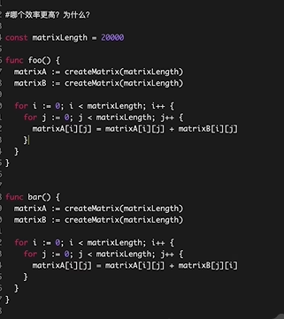

# **Go 题**

## **总览**

1. go，channel、锁、pprof、trace、gmp、gc、tcmalloc
2. 微服务，gin、go-zero、kitex，grpc、注册发现、限流、熔断、降级、链路追踪
3. 数据结构与算法、架构设计（4+1、3中uml图）、设计模式
4. 高性能、高并发、高可用，数据库、缓存、队列架构原理、使用与调优
5. linux、docker、git、ci/cd
6. 分布式存储系统原理，ceph、k8s、pve、kvm
7. ai工具，大模型架构、ai应用

## **BL初级**

1. make 和 new 的区别﹖
2. 了解过golang的内存管理吗?
3. 调用函数传入结构体时，应该传值还是指针﹖说出你的理由?
4. 线程有几种模型?Goroutine的原理了解过吗，讲一下实现和优势?
5. Goroutine什么时候会发生阻塞?
6. PMG模型中Goroutine有哪几种状态?
7. 每个线程/协程占用多少内存知道吗?
8. 如果Goroutine—直占用资源怎么办,PMG模型怎么解决的这个问题?
9. 如果若干线程中一个线程OOM，会发生什么?如果是Goroutine 呢?

项目中出现过OOM吗，怎么解决的?

10. 项目中错误处理是怎么做的?
11. 如果若干个Goroutine,其中有一个panic，会发生什么?
12. defer可以捕获到其Goroutine的子Goroutine 的panic吗?
13. 开发用Gin框架吗?Gin怎么做参数校验?
14. 中间件使用过吗?怎么使用的。Gin的错误处理使用过吗?Gin中自定义校验规则知道怎么做吗?自定义校验器的返回值呢?
15. golang中解析tag是怎么实现的？反射原理是什么？通过反射调用函数
16. golang的锁机制了解过吗? Mutex的锁有哪几种模式，分别介绍一下? Mutex锁底层如何实现了解过吗?
17. channel、channel使用中需要注意的地方？
18. 数据库用的什么？数据库锁有了解吗？mysql锁机制讲一下。mysql分库分表。
19. 讲一下redis分布式锁？redis主从模式和集群模式的区别了解过吗？redis的数据类型有哪些？redis持久化怎么做的？
20. 编程题：你了解的负载均衡算法有什么？实现一个负载均衡算法。

## **BL中级**

1. 自我介绍
2. 代码效率分析，考察局部性原理

3. 多核CPU场景下，cache如何保持一致、不冲突？
4. uint类型溢出
5. 介绍rune类型
6. 编程题：3个函数分别打印cat、dog、fish，要求每个函数都要起一个goroutine，按照cat、dog、fish顺序打印在屏幕上100次。
7. 介绍一下channel，无缓冲和有缓冲区别
8. 是否了解channel底层实现，比如实现channel的数据结构是什么？
9. channel是否线程安全？
10. Mutex是悲观锁还是乐观锁？悲观锁、乐观锁是什么？
11. Mutex几种模式？
12. Mutex可以做自旋锁吗？
13. 介绍一下RWMutex
14. 项目中用过的锁？
15. 介绍一下线程安全的共享内存方式
16. 介绍一下goroutine
17. goroutine自旋占用cpu如何解决（go调用、gmp）
18. 介绍linux系统信号
19. goroutine抢占时机（gc 栈扫描）
20. Gc触发时机
21. 是否了解其他gc机制
22. Go内存管理方式
23. Channel分配在栈上还是堆上？哪些对象分配在堆上，哪些对象分配在栈上？
24. 介绍一下大对象小对象，为什么小对象多了会造成gc压力？
25. 项目中遇到的oom情况？
26. 项目中使用go遇到的坑？
27. 工作遇到的难题、有挑战的事情，如何解决？
28. 如何指定指令执行顺序？

## Bs

### a. 疯狂游戏

1.将数组里的元素转化为树(里面的每个元素有一个节点i问d和父节点id)

- 2.三个goroutine 顺序打印123
  -其它(常规八股文)
  -说说项目
- go语言中数组和切片的区别
  -tcp为啥三次握手
- 三次握手和四次挥手过程
  -四次挥手的TIME_WAIT和COLSE_WAIT
- 线程和进程的区别
  锁的底层原理是什么

### b. 百度

**问:1.php°和go优缺点**
**问:2.线程，进程，协程的区别**
**问:3.GO带缓冲和不带缓冲去的chan的区别**
**问:4.Go垃圾回收机制**
**问:5.Hash表是怎么实现的**
**问:6.连接池是怎么实现的**
**问:7.TCP连接创建和关闭流程**
**问:8.浏览器输入网址，都经过哪些过程**
**问:9.linux shell top10命令**
**问:10.mysql和redis的区别和应用场景**
**问:11.编程，有序数组去掉重复**

### C. 卓拙科技

第一轮是答题，要求写的特别详细，3个小时做完的。后续有三次机会改正问题，问题会很详细的告知，体验很好。
第二轮是技术面，问了几个问题，比较有侧重点，好久没写go了，答的不是很好。
第三轮是HR面，问题都比较专业，HR小姐姐态度很棒，同时会有一个项目组leader在旁边回答疑问。

### d. 深信服

自我介绍介绍一下goroutine?
协程相比于线程的优势?

- channel说一下?
  -是不是并发安全?
  是异步还是同步?
  -go语言的数据结构?
  -map的底层说一下?
- map查找的过程?
  底层是哈希表实现的?
  -数组和切片的区别?
  -C++也可以随便问些?
  -多态是怎么实现的?

-C++的内存管理?
-完全二叉树和满二叉树的区别?
-了解红黑树吗?

- B树和B+树的区别?
  -遍历范围?
- 叶子结点是双链表连接的了解跳表吗?
  -解决map冲突的方式?
  -两种方式以上?
  -介绍一下三次握手的全过程?
- 这过程中传输了哪些信息?
- 两次握手可以吗?
  -为什么需要三次?

 解决map冲突的方式?
两种方式以上?
-介绍一下三次握手的全过程?
-这过程中传输了哪些信息?
两次握手可以吗?
-为什么需要三次?
-TCP和UDP的区别?为什么TCP是可靠的?

- 拥塞控制是解决网络拥塞还是服务器拥塞?
  -介绍一下拥塞控制?
  快重传和快恢复算法题:找出链表的倒数第k个节点

### d. 特博艾斯

1、存储过程有什么优缺点?

- 2、sql做过哪些优化，临时表优化有哪些方式，join小表关联大表的顺序?
- 3、索引如何建立，为什么要有主键索引，联合索引和关联索引区别，建立外键的好处?
  4、B树和B+树区别，可以手绘下?
- 5、redis有哪些数据类型，通常用于什么场景:string可以存储json，hash也可以存储json，有什么区别?(其实string类型就多个序列化过程)
- 6、redis过期清理策略，默认使用哪种方式?
  -7、python和nodejs区别，golang和.net区别?
- 8、谈一谈go里的切片，在一个函数里对切片进行修改会影响到原来的值?
  -9、无缓冲和有缓冲通道区别?

10、使用channel有什么注意事项，也就是什么时候会panic，如果重复关闭会怎样?

- 11、协程怎样使用，定义完就可以不管了吗，如何阻塞协程，为什么最后要用await，在gin框架里本身会阻塞，那在其他地方使用协程还需要使用await吗，在协程里还需要做什么工作吗，比如超时处理?(需不需要await就看最后是否要做收尾工作)
- 12、go里的垃圾回收机制，nodejs里的垃圾回收机制，垃圾回收主要回收栈上还是堆栈的?
  13、内存逃逸机制?
- 14、docker常用的一些命令，为什么要做目录映射，从本地拷贝一个文件到容器使用什么命令?
- 15、kafka的优缺点，topic是什么，怎么存储的:partition是什么，为什么要分区，replication是什么?
- 16、go里的互斥锁和读写锁区别，mysql里有哪些锁，乐观锁和悲观锁区别?

### e. bilibili

分布式锁的实现方式
kafka消息队列相关
http和https的区别
死锁的产生，如何处理
sync.map实现原理
context的作用、类别
sync.waitgroup用法
Go垃圾回收
用户表条目过多，查询减慢，如何处理
设计一个排行榜系统，积分高优先，同积分先达到的优先
将数组中的非零元素提到前面，保证顺序不变(简单双指针，一次遍历)

### f. 安克创新

3、数据库优化?
4、什么时候索引会失效?
5、GMP模型中全局G和P的作用?
6、gin支持路由正则?
7、http请求是如何匹配到后端服务?
8、路由映射表是什么数据结构?
9、http属于七层协议中哪一层?
10、http链接证书交换以后会做什么?
11、有看过go的一些源码?
12、切片实现原理?底层数据结构
13、切片是固定2倍扩容?
14、讲讲go的三个优点?
15、有看过那些专业书籍和感受?
16、过往工作中比较难的点，给你带来了什么提升?

### z. 收集

1.说一下go的select

2.slice和数组有什么区别
3.重复关闭channel 会怎样?向已关闭的channel 写数据会怎样?从已关闭的channel读数据会怎样?

# **企业**

## **UMU**

2026.02.25 线上1，20分钟，没问简历，N

1. 自我介绍，技能、项目情况
   回：名字，从事golang技术栈的研发，在数据库一体机、分布式系统、物联网平台积累了较多经验，近几年xx负责核心数据库一体机、备份恢复产品的后端架构设计与核心模块开发。
   技术上，对golang主要的底层原理、微服务、数据库、分布式高可用架构有较丰富的理解，熟悉主流中间件的架构，对较多大型系统有从0-1的完整开发与设计经验。
   项目上，我主导了三款数据库核心产品的研发，数据库一体机(IO)、极速恢复平台（RPO、RTO）、多元数据库承载平台（多元、IO、全国产）。GMP细节，调度策略
2. GM(全局锁竞争、开销)->GMP（用户协程、OS线程、逻辑处理器）。
   无锁本地队列（优先级、256、一半），全局有锁队列（61次一个、<=128）、入队出队、go func、空闲P偷取一半、阻塞M让出P寻找空闲M。sysmon切换掉执行超10ms的go。发挥CPU，负载均衡、防止饿死、复用资源
3. Slice底层、扩容原理
   len、cap、数组指针，扩容：2倍->1024  +=oldcap1/4，1.18版本后 2倍-> 256  +=(oldcap+256*3)/4，最后内存对齐。需预分配容量，copy()截取
   内存对齐是硬件和操作系统层面的要求，它要求数据的起始地址是其自身大小的整数倍，以提升CPU访问效率。
4. 操作系统进程、线程、协程的区别，进程的状态转换（就绪、运行、等待）
   资源上：os资源分配（页表刷新、G、管道），os调度单元（不需刷新、M、共享内存锁），用户线程栈上（少量寄存器，K，通信/锁）
5. 接口QPS限流设计，单人/单接口在1秒时间窗口内限制并发为1000
   令牌桶算法：now.Sub(lastT)->token+=delta->token-=n->n<=burst->ok
   漏桶限流匀速保护数据库
6. Mysql 优化，索引的成本，如何查看索引是否命中
   explain: type、key、extra、raws，创建联合索引，使用覆盖索引减少回表，表结构优化;读写分离、缓存、分库分表
   告警业务：api->时间埋点->mysql->慢日志->时间SQL-> explain sql -> 索引/失效->(type、key、rows、extra、opti_trace)逐步优化->数值效果，业务分库分表
7. 在项目中遇到的问题/技术调研、如何解决进行分享
   a. 写入etcd报错->iowait高->message中mvvc报错->etcd集群io磁盘，raft->根据业务分层，核心存储用etcd，硬件信息用redis缓存->存储架构下封装grpc中间件
   b. 数据库长事务/阻塞事件->日志写入报错->message io timeout/failed->对比存储日志->检查坏盘->踢盘/调整connect参数
8. 对新工作的规划
   云原生、数据库/存储上深耕，AI Agent
9. 对公司有什么想了解的

   ┌─────────────────────────────────────────────────────────────────┐
   │                     面试流程中的提问策略                         │
   ├─────────────────────────────────────────────────────────────────┤
   │                                                                 │
   │  一面（技术同事）    二面（技术Leader）    三面（总监/HR）      │
   │       │                    │                    │              │
   │       ▼                    ▼                    ▼              │
   │  问技术细节          问架构方向           问团队/业务/发展       │
   │  问日常工作          问技术挑战           问公司战略            │
   │  问代码规范          问成长路径           问文化氛围            │
   │                                                                 │
   └─────────────────────────────────────────────────────────────────┘

## 字

2026.03.26 线上1，30+30分钟，问简历，N

1. 自我介绍，技能、项目情况，我看你说做一体机和备份恢复，然后你介绍一下一体机大概是主要做哪些内容呢？
   名字。go语言技术栈，数据库一体机和分布式系统经验。go底层原理、存算分离分布式系统、高可用架构有较丰富的理解。中间件，大型系统从0-1的经验。
   项目上，核心项目的特点。
   产品定位（1句） → 核心功能（3-4点） → 我的角色（1句） → 技术亮点（2-3点） → 业务价值（1句）
   软硬解耦，三大部分全冗余分布式oracle高性能一体机。分布式、高性能、易运维。后端go，微服务架构层、存储池、NVMe-OF落地。数百家金融、政府机构核心系统转型支撑。
2. 你说存算分离，能大概介绍一下你们整个的 IO 链路吗？你们计算是直接用的 Oracle 的吗？还是自研的？
   写入：计算oracle写入数据->NVMe-OF到存储->写入NVME盘，ASM冗余副本（RDMA复制）
   oracle 集群，原生官网的。公司有基于pg自研的mogdb，一体机也支持。
3. 然后你们存算分离 RDMA 主要解决什么样的问题？你们的架构是从一开始就选择了 RDMA 吗？还是遇到了问题才引入了 RDMA？
   iops低、延迟高、cpu消耗。ISCSI->SPR->NVMe-OF，客户市场高性能需求
4. 你入职的时候是还没有使用 RDMA 还是已经是现在这套架构了？与体系相关的
   ISCSI->SPR->NVMe-OF，入职后研发NVMe-OF
5. 那你觉得你这个工作的复杂点或者是难点在哪？能具体介绍一下刚刚你说的这个问题吗？比如说 I/O hang，或者是其他方面？
   计算-网络-存储-硬盘，存算分离环节的复杂性。
   数据库长事务/阻塞事件->日志写入报错->message io timeout/failed/reset->对比存储日志->检查坏盘->踢盘/调整connect keepalive参数
   ROCe交换机PFC、ECN未生效，ip a->网卡丢包查询->内部复现，重置丢包数->几天观察调整交换机参数->询问厂商支持
6. 存储链路的网络问题 hang 住了，和协议层的关系是什么？你对外包装了一个无线重试的接口，还是说你会把存储只要不返回就返回。对外给卷或者是快设备或者文件系统，你是怎么做的？超时？
   不会无线重试，快速失败优先。故障iohang 超过30s->配置nvme connect+nvme_core重连->效果30s->10s内
7. 我看你还说你做了备份恢复，相关的事情，大概的流程是怎么样，支持哪些数据库？
   RPO秒级+RTO分钟级。oracle: socket备数据文件、实时redo、验证库、快照副本，mysql: xtrab数据文件、实时binlog、快照。ZFS 快照+压缩。
8. Oracle 的备份恢复是怎么实现的？MySQL 的备份恢复流程是怎样的？mysql 备份过程中的主要原理(xtrabackup、引擎)
   RPO秒级+RTO分钟
9. MySQL 内部的话是怎么用到这个数据文件，并且是怎么去恢复的？
   全备+增备->定时xtrab备份redo log->进行prepare后可恢复->一致性快照->binlog日志
10. 这个备份恢复在线上运行的时候，最大的库是多大的容量？几个 T 的那个文件的备份延迟和带宽是多少呢？就如果我要做一个完整的备份，不是增量备份，要做多久？
    几十、几百TB，磁盘带宽约500M/s、1ms，按公式计算几小时-十几小时
11. 整个备份链路上的瓶颈点在哪？你说带宽是说本地 IO 磁盘带宽，还是上传到远端的带宽？
    本地备份链路：远端读取->网络传输->zfs目标端写入。有压缩需耗CPU、盘io性能
    异地恢复/容灾：本地 ZFS 读取→ 网络 → 远端 ZFS映射。网络带宽、网络延迟、挂载点盘io
12. 你们的远端存储选的是什么？你这个备份服务器会同时服务多少个数据库啊？是单点吗？
    一个备份服务器备份数十套数据库。单机版本地/映射，集群版本ceph存储管理卷，映射到备份服务器。zfs可设置磁盘冗余。
13. 然后你相当于意思就把远端存储挂在这台机器上。然后走这个机器做一层转发。它的机器的作用是什么？为什么不是直接写远端呀？比如把这个云盘挂到那个数据节点的某个目录下，不就直接可以用了？为什么需要一个备份服务器？
    作用：ZFS数据管理、计算-存储分离、压缩、快照、一致性校验、统一调度。RTO分钟级目标
    远端云盘：性能影响、资源争抢、IO阻塞、管理复杂
14. 你做备份这块的话，看起来主要在做存储IO 级以下是吧？
    不止是，企业级备份系统的完整设计，从存储io到计算、调度、容灾策略的完整链路
15. 就是像 SQL 引擎协议那块，你们会直接运维吗？还是有其他的 DBA 在搞？比如说存储引擎或者是SQL优化器，或者是，这就简单说就是 MySQL 上层的逻辑。你们会接触吗？
    全链路问题分析
    存储引擎是需要了解的。备份的事务、redo和binlog、锁、主从复制GTID、InnoDB数据文件结构。SQL优化器备份时没有涉及到。
16. 你们的操作单元核心还是基于工具和文件在做，对吧？
    底层基座是这样。不过备份系统还有上层的抽象，断点续传，数据文件校验、策略调度分层
17. 快照你主要做的是什么效果的快照？COW？ZFS 文件系统
    Cow覆盖写，先拷贝再新数据写入原块，快照数据不限，空间利用率高
18. Golang 的话如何去终止一个 Golang 的 Go routine 啊？ 具体会怎么写呢？
    chan/context，go fun(){for{select{case <-ctx.Done())}}}}}（）
19. Golang 里面的像空结构体和 interface。 有什么区别？
    struct{} 类型，面向对象组合，0字节，信号发送；interface{} 抽象接口，任意类型16字节
20. Channel 的内部数据结构是什么样？
    无缓冲ch同步阻塞，有缓冲ch异步有容量/有数据时非阻塞，关闭/发送/接收，nil/close/not close
    核心是hchan，通过环形缓冲区buf存储数据，双向链表等待sendq/recvq管理阻塞的goroutine，通过互斥锁mutex保证并发安全。无缓冲时直接用双向链表传递数据，有缓冲时先用环形队形。
    发送时->等待recvq队列->若无->检查缓冲是否满->若满，添加到sendq队列。接收时->等待sendq队列->若无->检查缓冲是否空->若空，添加到recvq队列
21. 你那边有没有接触过像 K8S 呀这种云原生的技术啊？
    有短时间接触过operator/csi，k8s申明式API、调谐循环、星形架构、Pod调度、Inform、Watch、Reconcile、组件职责，csi pv/pvc/storageclass 认证、节点、卷。
22. 那你接触过的话，你觉得他为什么要设计调谐这个概念？他有什么收益？他从软件开发这个层面上，他到底是解决什么问题？
    分布式系统状态不确定，用声明式API向期望收敛，故障自愈，弹性伸缩。简化代码、提升可测试性，承认不可靠用调谐替代一次性命令，目标驱动
23. 你能够介绍一下就是你们管控的核心架构吗？就比如说你们的服务，你们的逻辑服务是怎么部署的？你们的接口或者是你们的 Meta 数据是怎么存储的？产品技术架构讲解
    分层架构：客户端->网关层nginx、gateway(代理、鉴权、用户、流量管控)、微服务层（监控、存储、计算）->存储层，根据业务核心存etcd、redis、mysql，
    内部高频的用grpc，对外的用http
24. 你们创一个数据库的，是那个应用或者实例，创一个库的话，你们的资源管理是怎么分配的？
    创建集成paas平台，存储池->卷->NVMe-OF->计算->块设备、文件系统格式化->pass平台用户、目录->互信->选择存储
25. 你刚刚说这个管控的话，有容灾机制是什么样的呢？就是比如说机器故障或者是机房故障，是怎么治愈的？或者怎么处理？HA 是怎么做啊？
    Proxmox HA 基于ceph新节点接管、看门狗(硬件计数)信号故障重启机器
26. 你自己做的一次技术选型和决策，然后大概的过程是怎么样的？推进这个语言重构的事是吧？
    lvm->zfs，lvm row，zfs cow、压缩、一致性检查、数据、快照速度
    写入etcd报错->iowait高->message中mvvc报错->etcd集群io磁盘，raft->根据业务分层，核心存储用etcd，硬件采集信息用redis缓存->封装grpc中间件
27. 你那你在那边带人吗？概几个人团队？
    有过3-4，校招，新入职，产品熟悉技术路线。
28. 做个代码题：写个LRU缓存，put/get没调用要随着时间x过期
    hash+双向链表
29. 对公司有什么想了解的
    云原生用到哪些、veDB支持业务量、架构业务的难点

## 泛

2026.04.09 线上1，42分钟，问简历
1.我们今天主要聊一下技术方面的东西，你看方便先做个自我介绍吗？
名字+技术栈+擅长业务+核心项目优势

2.数据库一体机你在这里边是个什么？做哪些东西？
微服务系统设计、全模块go开发、python->go、压测POC

3.一体机它就有那个数据库的，数据库方面，然后也有后端的存储。你说的是偏偏更上面的，还是更偏下面的？
存储端，存储池、卷管理、横向扩展、NVMe-OF高性能、计算端多路径

4.数据库**的话**是用的开源的还是商业的？还有或者自研的？
计算用的oracle ，支持信创全国产化演进，也支持自研的mogdb

5.做的主要是管理层面的，是吧？
存储端，NVMe-OF高性能，数据库管理、告警监控、巡检、一键日志

6.有涉及到数据库高可用的东西吗？分布式的架构

mysql，主从+VIP+keepalived

oracle ，RAC+ADG，VIP

7.你如果要做一个数据库集群的话，这个集群是怎么做的？你这有涉及到吗？

文件系统、块设备、网络、互信、ASM。读写比例、RPO/RTO、可用性、高性能与扩展性

8.有一个核心的，就是说故障切换方面的，因为作为高可用来讲的话，主要就是说在故障的场景，然后集群仍然能够提供服务。

VIP+Keepalived、MHA(ssh)、MGR(Proxs)

9.你是说通过VIP来做的吗？

对外服务VIP，存储层用ASM冗余，仲裁盘进行均衡

10.在你的工作中有实际涉及到数据库高可用这一块的方案，比如说方案设计或者是对应的功能开发之类东西吗？

存储、计算、管控三层高可用

11.你是主要负责和存储对接的吗？

不止是存储对接，以存储为核心，延申到os定制调优，往上到数据库高可用，一体机管控、监控告警，全链路问题分析

12.存储这边来讲，那你可能就是 Nvme over RDMA 这样的一个连接，对吧？通过这样来挂载一个块设备。
高性能RDMA，绕过内核，高性能低延迟无损耗。协议理解、全链路IO认知、内核知识、性能调优、问题处理

13.这里边的多路径是怎么做呢？DM他这样性能不大好啊
dm->原生多路径。
dm是在通用块层上做io栈的拦截、状态维护、路径切换。会引入额外的内核上下文切换、锁竞争、高尾延迟
原生多路径。并行无锁、硬件卸载、故障转移
dm可适配低性能存储iscsi、旧的os版本、lvm/udev高级配置

14.原生多路径是你这做的吗？对 RDMA 技术有了解吗
驱动和内核开发人员做的。我们是理解并调优。optimize，/sys下控制器设置一些参数。绕过内核加速相同与网卡直连，高性能低延迟，nvme connect、nvme_rdma参数调优

15.有做过RDMA方面的开发吗？RDMA有几种连接方式啊？比如说里边的那个 WQECQRC 这些概念有了解吗？
RC可靠连接、UC不可靠连接
WQE工作队列元素、QP队列对（发送和接收）、CQ完成队列、EC事件通道

16.就没有去做它协议相关的东西，管理的那个 NVM over RD made那种发现？存储端的target，然后是那东西吗？
是的。主要是在协议层、存储端，发挥RDMA的性能优势
18.解决过在这个上面遇到的比较有难度的问题吗？能够具体说具体一点吗？当时遇到的问题是什么？然后是怎么去发现问题原因的？然后具体是怎么修改的？
应用->驱动->内核->网络->内核->驱动->盘/硬件
19.可以具体到某一个问题吗？不是说一类问题，它具体发生的现象，然后是怎么找到的问题的原因，然后又是怎么去做的相应的修改，具体到某一个，就是具体的一个问题。
数据库->fio 测试>计算message io timeout/reconnecting，链路active减少->存储端存储链路闪断连接控制器->nvme list-subsys发现状态creating->io_timeout、keepalive_tmo、fast_fail、reconnect、ctl_loss
nvme connect -c 1 -l 15 -k 5 -i 8
20.然后就把网络恢复了，就恢复了？那这些参数去调它总得有个依据，为什么会需要那样去调**参数**呢？他这个参数有效果的原理是怎么样的呢？
阐述**延迟、超时、重试**这三者之间的量化关系，以及如何在 **“高可用”与“高性能”** 之间做出权衡
产品规格要求，数据库业务redo切换场景。nvme connect 重连参数，不能无线重试会阻塞数据库业务，keeep-alive
5秒的 `io_timeout`、8秒的 `fast_io_fail_tmo，有效隔离网络抖动带来的极端长尾。fast_io_fail_tmo 保证了故障能快被发现；ctrl_loss_tmo 推动了主备的快切换；reconnect_delay 则防止了网络恢复时的快重试风暴`
22.keepalive是谁和谁？keepalive 为什么调它会有效果？它是RDMA连接的keepalive吗？
设置的是  **NVMe协议层的keepalive** ，是 **Initiator（计算端的NVMe驱动）** 和 **Target（存储端的NVMe控制器）** 之间的心跳。RDMA连接本身有自己的保活机制（RC QP的 `keepalive`）
23在这个里边你们会去做一些可观测性方面的一个系统性的东西吗？可观测性
**Metrics（指标监控）快速发现问题、**Logging（日志） 定位问题根因、**Tracing（链路追踪）理解性能瓶颈******
24. 普罗米修斯会去采集哪些东西呢？会涉及到IO性能方面的监控吗？
IO延迟过高、硬盘离线，数据源->exporter->prometheus->altermanager->webhook->告警落库->推送
分级告警，预警、紧急、故障
25.你做过存储相关的压测，是吧？
fio/vdbench，数据库业务sysbench、benchmark。`iodepth `进程队列深度，`numjobs` 并发进程数。总并发 = `iodepth × numjobs`。高并发时需平衡。
26. 会去分析具体的问题吗？就比如说有具体的。其实在你那不涉及是吧？因为直接测的是存储团队，然后内部的数据库的话也是相当于是外部的或者是开源的
oracle数据库一体机自研存储，国产化分布式块存储zdatax，硬件规格、性能规格。**跨界分析、能团队协作、能推动问题解决，找出证据翻译成专业语言。**
27.就在这一段开发工作经历当中，你做过的最有挑战性的一项工作，或者是一个问题，可以具体描述一下吗？最有挑战性的技术难度方技术，比如说技术难度最高的。需要你自己做的
早期python时设计问题监控网页显示数据存etcd，etcd磁盘io要求较高，强一致性，并发性能不太好。关键数据、核心存储数据存入etcd，监控数据分离到redis
28.开始把监控数据放到etcd里面吗？那你现在具体就是在使用ETCD上面，除了那个key的put get之外，还有其他的用法吗？在哪个场景需要做分布式锁呢？
**细节** ：Lease（提供TTL）、事务（保证原子性，实现锁的公平竞争）、Revision（全局自增主键，用于实现分布式序号）
基于ETCD实现了一套高可用，缓存到本地sqlite，选举，某节点离线策略业务不中断
29.你们现在是典型配置，是3个节点。你们的软件是工作在计算节点还是存储节点？
存储、计算、监控，
30.就你刚才说的那个例子，就是你设计一个拍照的那个例子，就相当于是你的是，我理解你的是一个管理系统，对吧？然后他工作在自己的存储节点上面
每种类型节点部署agent支撑服务。我明白，就是说你会搞很多agent，然后你们自己的软件的master，或者是说主要的那个服务是工作在哪里呢？一个单节点吗？
web管理监控单节点只做功能。存储核心功能高可用部署，单节点故障不会影响存储核心业务。新版本使用虚拟化功能，用虚拟机HA方式防止单点故障，用的os看门狗，硬件计数。保证核心存储功能，在软件复杂度和高可用上的均衡。
32.如果你的管控端故障了，那你怎么打快照呢，到存储三个存储节点，你们的agent上面，是吧？我们来仔细捋一下这个架构，就是说假设你的是快照，配置了一个快照策略，是吧？这个快照策略的这一个配置是放在哪的？是放在ETCD吗？
etcd watch(策略同步))+本地sqlite缓存元数据记录+故障恢复后进行一致性上报
34.监控上面，然后用本地文件系统，然后做，就是直接Mysql，是吧？这里就存在一个。为什么有的存在Mysql，有的存在 etcd？它的区分的界限是什么？换句话来说，就只有存储相关的东西才会存到ETCD，是吧？ 比如快照在Mysql会存一份，ETCD也会存一份。比如说出现啥故障了，同步不了咋办呢？就说你的数据以Mysql里边的数据为准
etcd 存元数据配置关键信息、MySQL 存历史记录。etcd 负责分布式协调和强一致元数据，MySQL 负责大容量历史数据查询。存储资源以etcd的为准
36. 那为什么你不直接把这一条那个数据放一个ETCD里边不就好了呀，这两种方案你觉得哪一种更合适呢？把那个快照策略是放在agent自己的缓存里面，还有就是放在ETCD里面，这两种方案肯定各有优点、缺点，对吧？
策略配置信息存入etcd。大量快照存入mysql。创建/删除一个快照的操作日志存入sqlite。最终一致性同步到mysql 显示。etcd写入频繁会带来性能问题
37. 行，我这边没有其他问题了，你看对我们这有哪些方面是需要了解的？
a. 那你这个岗位主要是管控端还是存储端
b.块存储还是什么存储的?基于Ceph的吗？
c.会涉及数据库相关的吗？目标客户？
d.那你们这边管控端会有做这些高可用的这些架构吗？
e.假如入职这个岗位会做些什么？会有什么挑战吗？近期？
f. 那你们这边一般的话也是三个节点存储

## 数智

线上1，40分钟，问简历，N

1.我们先做一个简单自我介绍嘛？云和恩墨是在成都还是在北京啊？
名字+技术栈+擅长业务+核心项目优势
2.那对goroutine的那个调度模型，GMP的调度模型的原理有了解吗？
GM(全局锁竞争、开销)->GMP（用户协程、OS线程、逻辑处理器）。
无锁本地队列（优先级、256、一半），全局有锁队列（61次一个、<=128）、入队出队、go func、空闲P偷取一半、阻塞M让出P寻找空闲M。sysmon切换掉执行超10ms的go。发挥CPU，负载均衡、防止饿死、复用资源
3.包括它GC的那些机制，比如三色标记这些，写屏障、STW这些呢
演进，减少STW、防止引用中的对象被误当作垃圾
4.用协程池去处理高并发嘛。那协程池我们是怎么去实现的？怎么去确定协程池的大小？去做优雅关闭呢？你整个生命周期怎么去管理呢？怎么去做优雅关闭？
协程池的核心价值是**限流 + 复用**，压测找拐点：TPS不再增长、RT急剧上升的那个值，乘以0.7作为生产上限
分四步：1) 设置标志位拒绝新任务；2) 等待所有worker完成当前任务；3) 设置超时兜底，防止卡死；4) 关闭任务队列。这样能保证提交的任务不丢失，也不会无限等待。
5.那我们平时有用过一些性能分析的工具吗？比如说 pprof 这种去定位一些CPU或者内存goroutine泄露的问题
pprof监听、web、top分析。CPU、内存、协程泄露
6.提到了一些消息队列，比如说Rabbitmq，Kafka，Redis stream。选型对比
基于**场景和数据**的理性决策，原则是：**绝不只用一种消息队列去解决所有问题，而是根据业务对可靠性、吞吐、延迟、业务复杂性这四个维度的不同要求，选择最匹配的组件。
底线是：**数据绝对不能丢？复杂业务要重试加死信？** —— 选 RabbitMQ。**数据量极大且要重复读？对接大数据生态？** —— 选 Kafka。”轻量管道用 Redis Streams。
rabbitmq三个关键阶段： **生产者 → 交换机 → 队列 → 消费者** 。每个阶段都可能丢失消息.**Publisher Confirm、手动ack、**持久化、**重试+死信、**仲裁队列
**死信（Dead Letter）** 是指无法被正常消费的消息。当消息成为死信后，RabbitMQ 会把它重新发布到另一个交换机（死信交换机），这个交换机绑定的队列就是**死信队列********
7.如果用Redis的话，可能会遇到哪些问题？如果中间件挂掉了或者出问题了，我们整体服务。怎么去做一个异常的一个处理？
**缓存雪崩（随机值）**、**缓存击穿**（互斥锁）、**缓存穿透**（布隆过滤器 + 缓存空对象）、分布式锁（**锁未释放**、**锁重入**）
当 Redis/RabbitMQ 挂掉时，核心原则：**快速失败 + 降级服务 + 数据不丢 + 自动恢复**
8.平时我们在项目里面遇到过的比较大的并发量大概有多少？实际生产环境。QPS能达到几千上万，是吗？
千/万级别。协程池、批量处理、异步化、削峰填谷、缓存策略
并发指标：QPS、TPS、P99RT
9. 高并发可能是集群部署，那一个服务大概要有多少个实例去？
万级别->几个，**实例数 = (目标QPS × (1 + 冗余系数)) / 单实例安全QPS**
10.有一个Oracle备份恢复的功能，是用c语言开发了一个socket的客户端，是吧？那这个socket的协议是自己去设计的还是用的哪些协议呢？我指的是你 TCP 去发送的那个数据包，你肯定有对应的，比如说一些协议头，然后要处理一些粘包或者是丢包的东西，对吧？
为传输数据定义明确边界。常用：固定长度（空间浪费）、分割符（可能与消息体冲突）、长度前缀（4字节头带数据总长度通用）
精确字节读取/写入循环+长度固定帧，发送数据文件前，会先发一个4字节的长度帧头，通知接收方传输的数据文件字节大小
12.有在Golang里面直接去调过c相关的库吗？那用CGO的过程当中会有没有说踩过一些坑？CGO的性能感觉怎么样？
内存泄露 cgo 手动free，性能差（数十纳秒），上下文切换高（栈的切换处理寄存器状态）、批量处理减少c调用
13. 比如说你c部分的代码去执行出现了错误，然后我们怎么去定位去和排查？
日志、strace、gdb、dlv
14.我看后面有这个智能家居的云平台的一个开发，但是这里面使用到消息队列还是 Rabbitmq，我想问一下这里面没有去选 MQTT 是一个什么原因呢？
mqtt节省带宽、持久化弱。rabbitmq高可靠、持久化
15.我看好像还做过这个Python项目到Golang项目的一个重构嘛。动机到底是什么？最终我们性能指标有没有提升？这个重构过程当中遇到哪些就是挑战或者是比较棘手的问题？
python GIL锁、性能慢。go 并发、内存占用低、静态语言安全
17.mysql慢查询我们怎么去定位？有没有比较印象深刻的一些SQL相关的优化？做了某些优化之后，它这个查询效率提升很比较大。
explain，type、key、rows、extra，覆盖、联合索引，offset改游标，分库分表的分片键。防止索引失效，optime_trace
18.我们平时在开发的过程当中用到了哪些AI相关的Web coding的工具？大概我们要分哪些流程呢？
claudecode（agent、命令行、上下文）、cursor（ide友好）
20.你这边有什么问题吗？
a. 就哪些业务上的，可以简单讲一下吗？
b.后端技术上面的一些架构上面的一些事情?微服务中间件、分布式系统?
c.那你这个S3是你不在你们机器上吗？还是用的云厂商的？
d.那假如入职的话，这个岗位近期有没有什么挑战的一些功能或者任务吧？

## 海1

2026  15分钟 N

1. 自我介绍
   个人、技术、项目、优势
2. 中间件的话是主要是用自研的数据库吗？还是说开源这块的？
   开源，oracle、mysql
3. 华为的数据库，底层是用的Mongo，然后上层是架的那个ES加字节的一个一二级的一个缓存，然后相当于用户在就他们自己本地平台在使用的时候可以无感地去操作Mongo，然后的话并且能够使用到命中哈ES的一些特性和他们缓存的一些特性。为何这样设计
   一级缓存（本地/内存）—— L1 Cache、二级缓存（Redis/分布式）—— L2 Cache、Elasticsearch（索引/搜索层）全文倒排检索、MongoDB（主存储/文档层）
4. 一些新型的数据库，比如说像cassandra，然后这些这种高并发类型的数据库有没有去接触过呢
5. 真实的业务场景当中想去解决微服务架构里面的一些事务，如果说就对应着你目前的这种情况的话，你会去怎么样去设计这套架构
   本地消息表加消息队列、TCC、Saga
6. 有没有去了解过那个Mysql的一个多层架构呢？处理优化器，以及他的那个存储引擎这一块有没有去了解过呢？
   连接层->服务层,优化器->引擎层,InnoDB (事务、行锁、MVCC、聚簇索引)->存储层，.ibd / .frm / ibdata1 / redo log / binlog
7. 最近在使用和cloud code来进行那个项目开发，他们的区别又在哪里呢？MCP其实已经能够满足我们绝大多数的需求了，那为什么还需要skills这个东西？
   点说：**MCP 解决了“能不能做”，没解决“做得好不好、规不规范”。**
8. 目前在项目当中，你目前是做什么样的一个工作呢？
   应该 **突出你的“技术领导力”和“架构设计能力”** ，**解决难题、把控质量、推动技术演进** 。
9. 普罗米修斯的底层存储了解吗？
   tsdb，顺序 WAL + 批量刷盘、压缩算法、倒排索引 + 内存 Posting List、WAL 重放
   倒排索引是一种 **从“属性值”反向查找“文档”** 的索引结构。用于实现  **根据标签快速查找时序数据** 。**任意标签组合、**交集运算极快、Roaring Bitmap 压缩率极高、**增量更新。高基数缺点******
10. 对外http，服务间选择GRPC 一般是用于什么样的场景呢？
    二进制 (Protobuf)，体积小，序列化极低，HTTP/2（多路复用，内部微服务、高性能后端、流式接口

## 新1

2026.5.7   01:14:10 没问简历

1. 自我介绍
   个人、技术、项目、优势
2. 业务介绍，运营解决方案，数据库运营工具
3. 数据库的一个几范式、一范式2范式3范式和反范式，你能简单谈一下吗？
   减少数据冗余、避免更新异常。属性不可再分、完全依赖主键、不依赖其它非主键。遵循需join，可以适当违背范式冗余字段
4. 那个数据库索引的一个原理
   B+数据、矮胖树、叶子节点存数据双向列表、非叶子节点存储主键索引、三四次IO
5. 用b加树，他为什么不用平衡树？二叉树？
   为了查找效率，还有就是减少磁盘IO访问
6. 对数据库锁
   全局锁FTWL、表锁LOCK、行锁 FOR UPDATE、意向锁、间隙锁
7. 你会怎么解决？如果出现死锁
   三板斧：先用 `SHOW PROCESSLIST`看有没有Waiting的线程，再用 `INFORMATION_SCHEMA.INNODB_TRX`找到持锁的长事务，最后用 `SHOW ENGINE INNODB STATUS`分析死锁细节。定位到阻塞源头后，通过 `KILL`应急释放，然后根据 `EXPLAIN`优化SQL或缩短事务长度来根治
8. 怎么做这个SQL优化的？
   explain sql / optimize_trace
9. 预防数据库的一些风险，你会从哪些层面入手？
   **开发阶段** ：坚持**读写分离**和**连接池隔离**、**上线阶段** ：强制执行 **SQL Review** ，使用 **gh-ost** （影子表）进行无锁表结构变更、**运行阶段** ：配置**连接池熔断**和**慢查询限流
   **故障阶段** ：建立**主备自动切换**和**定期备份恢复**机制
   集群、限流、熔断、降级、重试/超时**
10. 数据库的一个主从复制原理
    主库开启 `binlog dump` 线程、从库I/O 线程-拉取、从库SQL 线程-relay回放。
11. golang中make和new有什么区别？切片和数组呢？
    核心一句话：**`new` 用来分配内存，返回指针；`make` 用来初始化引用类型（切片、map、channel），返回类型本身
    核心一句话：**数组是值类型，长度固定；切片是引用类型，动态数组的结构体视图。****
12. 使用mysql库的时候如何用go去保证并发的一个安全性？
    结论：MySQL自身通过事务和锁保证数据一致性，Go的责任是正确使用连接池、管理事务边界，并通过业务层（如Redis分布式锁、乐观锁）来补充数据库层面的不足
    go chanel、mutex、rwmutex、原子
13. 你在使用go的时候有没有碰到内存逃逸的问题？
    核心结论：**内存逃逸是指变量本应在栈上分配，结果跑到了堆上。导致堆内存分配增加，加重GC压力，影响程序性能。
    用 `go build -gcflags="-m"` 观察逃逸，变量指针、interface{}、切片、闭包*
14. 使用go过程中，在什么情况下会发生内存泄漏？你怎么定位和排查？
    未关闭资源、切片无线增长、go泄露
    pprof，top、web
15. goroutine它和线程有什么区别？
    os调度最小单元、mb、内核态切换，go 堆上协程栈、kb、用户态调度
16. 向channel发送数据和从channel读取数据，它的一个流程分别是怎样的？
    核心结论：channel 的发送和接收本质是“内存复制 + 队列操作 + goroutine 调度”。无缓冲和有缓冲 channel 的行为差异巨大，关键都在于“谁等谁”的调度逻辑。
    是否缓冲环形、缓冲满/空、发送/接收、发送/接收等待go双向链表
17. 你在使用go的时候经常碰到哪些问题？TOP3，然后又是怎么分析和解决的？
    goroutine/内存泄露/锁并发、逃逸到堆GC分析、内存对齐(unsafe)os字长，减少CPU访问内存次数（对齐系数、大小）
18. 有没有写过技术方案啊？目录大纲
    背景、目的、术语、核心组件、核心业务流程、指标、安全性
19. Redis 有没有做技术选型？你对Redis了解怎么样？
    核心结论：**Redis 选型需要从数据模型、持久化需求、一致性要求、成本四个维度评估。我的理解覆盖核心数据结构、持久化机制、高可用方案和常见坑。**
20. 你在使用Redis时候，如何去保证Redis和数据库的一个数据一致性问题？
    **操作时序 + 并发 = 不一致的根源
    **先更新DB，再删缓存**、**先删缓存，再更新DB**、**延迟双删**、**订阅Binlog**、**消息队列重试**、**
21. 缓存击穿的时候，一般情况下怎么处理？
    雪崩、键同时过期、随机，击穿、热点数据过期、互斥锁，穿透、布隆过滤器、拦截不存在的
22. 你了解哪个消息队列？RabbitMQ和Kafka都有什么区别？
    **RabbitMQ：复杂路由、高可靠**、阅后即消、**万级**，Kafka：**极弱**路由、**持久存储、十万/百万级、海量数据**
23. 使用那个RabbitMQ消息队列的时候，你如何去保证消息的可靠性，避免丢失？
    三个主要阶段是： **生产者→Broker** 、 **Broker→队列** 、**队列→消费者
    Publisher Confirm（发布确认） + 重试、队列/消息持久化 + 镜像队列、手动 ACK（确认）、、**
24. 你能谈一下你的优缺点吗？
    全链路问题解决与学习、go 分布式/高并发、多个系统0-1、全栈，研发紧张时前期设计较少妥协投入、表达较弱
25. 你前端会吗？
    vue
26. 你当前是什么工作状态？是在职还是离职？那离职原因是什么？
    待遇下调、换平台
27. 那你期望薪资大概在多少？适用24转正28
28. 你们这个到底是做什么？最后一个月是年终奖
    看表现13
29. 你个人的一个心态和抗压能力怎样？
    先解决问题，再复盘原因、长期数据库
30. 做开发的团队，你们现在有多少人呢？

因为正常来说是没有那个啥，是不会说别人一定会卡不住你的
如果ok的话，那么好就走下面流程，HR会对接入职相关事宜
这个我那个我再去思考一下
整体说下来之后，我们整体评估一下，这样子
先通过官方途径确定下来之后再说
Mysql、tidb、Mongo DB、Doris、Click house、silence

## od

### 1 笔试 4.19 165

P14201.8位LED控制器。位运算，8位LED，有L、D、T三个操作，最终输出十进制数字
P14202.分辨率排序。分辨率，4档，挡位->面积->宽
P14203.wif设备网络规划。AP网络覆盖3x3面积，求最少需要多少个覆盖MxN

### 2 性格、hr  4.30

离职原因
学历证书
期望地点
能否接收转语言
个人优势、劣势
婚否
目前薪资年包
加班接受

### 3 技术面  5.14

1. 自我介绍
2. 介绍下项目，解决哪方面问题这个？
3. 多少人去搞这块的？这4个人是咋分工的？你的角色
4. 这个任务是你一个人完成的吗？这个特性大概做了多长时间？里面有什么难点吗？
5. 大概介绍里面大概的一个模块吗？
6. 你们用啥框架了吗？
7. 微服这块的话整体你们是用容器吗？
8. 你访问数据库的话，那块有用户的限制吗？数量的限制吗？
9. 那个池子的话大概有多少的容量？
10. 跑那个程序内存大概多少？
11. 那个 IB和那个 ROKE 那些协议是吧？一直和存储在打交道？
12. 垃圾回收机器
13. GO 的函数的它，它的传递是传递方式
14. 切片传递到它数，那个里面的值可以会，为啥会能可以被改？Append？
15. 管道我关闭了，我还可以从管道里面读数据吗？关闭以后，我能往里面写数据吗？
16. 你要不要调过 C 的？
17. 协程和那个线程的区别吗？
18. Init 顺序
19. B 包里面，我怎么去访问包位的一些值？
20. 比如主动主动的相关设计？
21. 编程题复盘？怎么优化吗？
22. 括号去除多余的 -编程题

### 4 技术面  5.22 挂

1.重复数字以【数字，重复次数】,解压、填0、相乘、压缩
2.遇到的问题，是如何解决的
3.和其它团队如何协作的，多个团队如何推动
4.项目中有成就感的事情
5.职业规划

## 华鲲1 5.21

1. 自我介绍
2. 实现思路。假设说我用K8S也好还是怎么也好去搭一个就是集群，然后可能有比如说三台服务器，然后我要给这个三台服务器上的数据库做一个高可用，然后要实现说一台机器down掉服务器服务不能挂
3. 断电了，但是我们又希望这个数据库服务不能断，在实现这一部分你有什么思路没有？
4. 假设说我有一台节点挂了，然后你在另一台节点把他拉起来的这个动作，可能就有一点问题。三个键都飘在这同一台节点，然后这个一个节点挂掉了，你的服务器一个节点都没有了，还能高可用吗
5. 反亲和性或者亲和性这块要求它每个节点一个Pod. 不管是这个Mysql的operator还是Postgresql的operator，我们把这个节点拉起来，然后我们还有没有什么其他需要做的动作的？
6. 要做三节点高可用的数据库服务，那我们怎么实现这个需求？
7. 我们做完Pod层面之后，存储这块要怎么实现呢？
8. PV PVC,写在服务器的盘上。我们如果一台服务器挂掉了，它能保证不丢数据吗？
9. ceph 去承载这个数据库的log，之前你有没有验证过？性能怎么样？
10. 我在三个节点上布这个Ceph，那它其实你希望它实现的是块存储还是对象存储，还是文件存出来？
11. 块存储, 三台节点上我这个块存储它在每个节点上的呈现方式吗？它怎么能保证说我一个节点挂掉之后，另外两个节点还能保持数据不丢失的？
12. 假设说我从一个一台服务器的一个这个Ceph节点进去看它这个本地的存储，我能看到的是全局的还是什么样的内容呢？
13. 那对于这一台节点上它存到的东西是全局的吗？每个节点全量冗余吗
14. 做自动化部署这部分的时候，假设说我涉及到数据库的迁移。用migrate这个动作，就是我的这个版本，比如说26.1跟26.2这两个版本之间，这需要迁移数据库，那我怎么实现CD这个步骤呢？
15. 我后端就是有同时有几个数据库在服务器上的，就是新版本一个，旧版本一个?
16. 你肯定切一下你的数据源，直接切过去吧. 你如果要滚动业务无感知的话，还是要起两个。
17. 新库的时候，这个旧数据库一下线可能就会丢了一些数据。要双写吧？
18. 新版本里面搞一个什么异步线程从旧版本里面的产生的数据里面把它同步过来
19. 您平时写代码的时候会用AI吗？

    服务器硬件的，是不是？ NPU
    K8S？到底是解决什么问题呢？万卡的服务器去组一个集群
    软件部大概人人员规模有多少吗？十几个人
    最近裁员吗？

## 鼎Q 5.25 60分钟

1. 自我介绍
2. 对一个项目做个稍微详细点的介绍
3. 扩容的话，Mysql可以吗？oracle数据库一体机解决什么问题啊？
4. 会存几十t吗？架构同城双活，这个它是怎么做的吗？
5. 仲裁？一个机房对外提供是吗？还说两边都在同时提供，就是负载那种方式？ 两边提供读写，仲裁作为votingdisk防止脑裂
6. 仲裁选举保持它的一个存活，你双活什么时候去切换？
7. votingdisk磁盘组，来自于三部分
8. 全冗余式、分布式架构讲述。高性能网络协议指的啥？
9. 分钟级、秒级的那个Mysql恢复，如何实现的
10. 这个全量的话，你们是多久？
11. 你说第一次做那个全量的那个备份是啥意思呢？
12. 第三个项目有个分布式存储系统，它这个是一层，上层的那种，就是你们的 DB吗？
13. 我们那个Mysql或Oracle，它其实自己有很多元数据，对吧？就是它存储在磁盘上。状态的一致性，就是这个ceph它能保证吗？这些元数据和我们的真实的数据, 状态怎么去保证它的一个各种这种数据的状态的一致？
    Ceph通过分层元数据 + Primary OSD仲裁 + Peering恢复机制来保证一致性。Monitor存集群拓扑，通过Paxos保证强一致；OSD存对象元数据和数据，通过单机事务绑定两者的写入
14. 有可能我这个元数据都没写成功，但是我文件写成功了。用分布式文件系统，它是怎么去做的？
15. 那个K8S的核心的架构吗？
16. 那个operator和那个CSI在项目中主要做些啥？
17. Mysql和Redis Rabbitmq，你们都有调优的一些经验，是吧？
18. 这些组件的那个部署架构？它有哪些部署架构嘛？
19. 那个Redis的它的集群的架构它能保证，就是说集群架构，如果它集群架构，如果我挂了一个节点的话，它这个整个集群会影响吗？会有啥影响吗？
    **主从-无法自动切换、哨兵-无法使用空间、集群模式-哈希槽**
20. FIO这个工具干嘛呢？那这个工具没有问题吗？
21. 你们就会经常抓包吗？
22. golang 它的有哪些模型？g 它是用户态还是内核态？
23. 那个channel的那个底层实现？
24. 那 channel 的那个它阻塞是哪几种
25. 会不会用 shell？java?
26. Linux这些命令熟吗？
27. 工作中有没有遇到一些比较困难的一些问题？怎么去解决的？
28. 你们对操作系统这一块，网络这一块这个熟悉吗？
29. 操作系统文件读写这块你熟吗？就是它原理清楚吗？
30. 遇到一些磁盘相关的一些性能问题？ 磁盘磨损/寿命不足，换盘

    问：
    你们为什么要用到云原生呢？ 从底层去支撑上面的一些应用
    有时候可能要去修改它的源码，你升个版本一般就好了吧
    那你这个团队目前人人员规模大概多少嘛？我们现在有4个了，还要招两个呢
    那你们主要是做那个通信相关的，那你们这个部门会接触到公司的一个那个核心的那个产品吗？我对业务其实不太了解
    关心的就是说我们的一个可靠性和我们的性能
    那你这边是搞不搞公有云嘛？还是只是私有云这些？

## 鼎Q 5.26 20分钟

1. 简单谈一下，您对于这个职位以及这个公司应该是有一些了解
2. 你是觉得还是看中的第一大平台嘛？
3. 您家老家是哪里人？
4. 毕业以后整个的工作履历
5. 云原生从什么时间开始的？
6. 咱们就云和恩墨的工作展开介绍一下您在这个公司，1个成长的一个过程
7. 从中级开发到P6过程中有几个晋升阶段呢？
8. 您刚才也提到在这边也是有带一些带小团队，是吗？
9. 您在这边觉得这几年做下来收获或者成长性最大的是哪些方面呢？
10. 您对，怎么去看待带团队和您这个人对于技术的追求上，这两者之间有没有一些矛盾？或者对您带来的一些帮助或者困惑
11. 那咱们在这边整体发展上，您可能现在是出现了什么样的问题？您要去看新的机会呀？
12. 咱们在这边是一个什么样的薪资福利呢？您能把这个讲详细点吗
13. 只有月薪，没有其他年终或什么的，是吗？咱们收入里边有什么是工资的部分？有什么是奖金的部分？
14. 那咱们的那个公积金这些怎么交的呢？
15. 咱们公司规模是多少？什么？有多少人啊？
16. 咱们主要的to 就是面向的客户群体是什么呀？
17. 那咱25年全年总包是多少吗？26/27
18. 如果这边ok的话，您大概的入职时间要多久？2-3周
19. 您对于新的这个薪资上是有什么考虑呢？30%、20%+
20. 22年之后薪资是没有再涨过的，而且还降过。公司经营情况，降了些补贴福利
21. 其他的你有什么需要跟我了解的吗？
    第一面和第二面这边面完之后我们会复盘一下整个面试的一个评价情况，决定是否进行第三轮面试。前三轮面试的情况来去做一个就是offer的沟通
22. 你们这边的公积金社保是什么样的比例？分为工资、年终奖以及长期激励。根据年度的一个绩效进行一个评估，对内部长期发展的员工会有一个长期持股的这样一个激励
23. 每年15天的年休假，公积金的缴纳比例也是百分5
24. 你如果是拿满的话，你这个是多少个月的薪资呢？奖金它是在公司一定层级管理的，少到可以没有，多到可以很多。取决于公司当年的业绩、部门的绩效以及您个人的绩效
25. 长期激励是公司直接就比如做，我做了很久，这公司直接发吗？股票的部分都是需要员工购买的。
26. 近期考虑上市吗？
27. 你们也是双休嘛？上班是几点到几点呢？双休。8点半到9点，下午是5点半到6点，12点到1点休息
28. 公司现在推AI推的严重没吗？专门的项目组，不是那种快速推广的那种

# **案例**

## 工程

a. 许可证计数、策略分布式执行（解耦）、升级工具（flyway）、

nvmf控制器连接、rsyslog日志丢失、kvm技术、multipath命令卡住、时间服务器
b. 协程、内存泄露、脚本执行器、RPC异常日志; Python->Go，性能、安全、内存、开发效率的提高

## mysql索引优化链路

explain: type、key、extra、raw，创建联合索引，使用覆盖索引减少回表，表结构优化;optimizer_trace查看优化器索引选择； 读写分离、缓存、分库分表；游标替换offset
告警业务：api->时间埋点->mysql->慢日志->时间SQL-> explain sql / optimizer_trace-> 索引/失效->逐步优化->数值效果，业务分库分表

from alert_msg where  createdAt > 0 and createdAt <= 100 and  state='触发' and serverity='严重'

## etcd业务场景改造

etcd 磁盘io要求高，需要持久化、QPS 千级别、建议2GB、MVCC 机制会导致数据删除后磁盘空间无法直接回收，产生碎片；compact and defrag
etcd 碎片清理->磁盘占用暴涨->官网发现堆积碎片->执行etcd 清理命令->工具监控内存阈值执行，MVCC 历史版本未及时清理->通过 compact + defrag 组合
写入etcd报错->iowait高->message中mvvc报错->etcd集群io磁盘->根据业务分层，核心存储用etcd，硬件信息用redis缓存->存储架构下封装grpc中间件

## NVMeOF 下iohang

数据库长事务/阻塞事件->日志写入报错->message io timeout/failed/control reset/ list 状态重连->对比存储日志->message 重连日志->调整connect参数
nvme connect -c 1 -l 15 -k 5 -i 8
nvme_core max_retries=1，io_timeout=5
这条链路从上到下逐级生效，内核策略是：优先快速失败命令，避免重试；如果失败过多，则彻底放弃整个控制器连接。

默认无线重试、无超时、重连间隔短、保活过长

在"IO Hang"场景下，你提到的这些参数共同构建了一套**失败快速检测与有限重试**的精细化控制机制，目的是解决**存储系统故障时主机端IO栈的长时间阻塞**问题。

更具体地说，解决的是**防止因存储端故障（如网络闪断、控制器重启）导致应用进程在IO上无限期等待，从而拖垮整个系统**的难题。

## PVS命令卡死

os出现大量lvm卡住进程，占用os内存
坏盘->lvm命令卡死->cpu爆满->告警。剔除坏盘->对定时的lvm命令进行数量限制

## 快照策略下发、选举同步

list+watch；主节点时，其余节点work退出；存本地sqlite，可改造为etcd；消息表回调最终一致性

## Pprof

务内存高50GB，top（高）->systemctl（高）->pprof web图（高）->函数，观察Oracle 连接池有泄露，ssh执行命令泄露

## RoCE网络

RoCE 包堆积，PFC、ECN缓冲是否生效

## 分布式事务

### TCC

**事务设计（TCC）** ：在zDataX快照策略下发中，跨多存储节点创建快照策略时采用TCC模式——Try阶段预留资源（生成临时快照preparing），Confirm阶段正式生效，Cancel阶段补偿回滚。确保多节点备份“要么全成功，要么全失败”，try所有节点成功后再将快照状态设置为成功。
