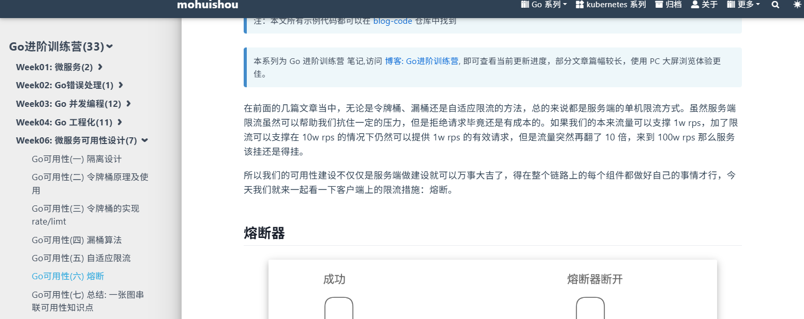
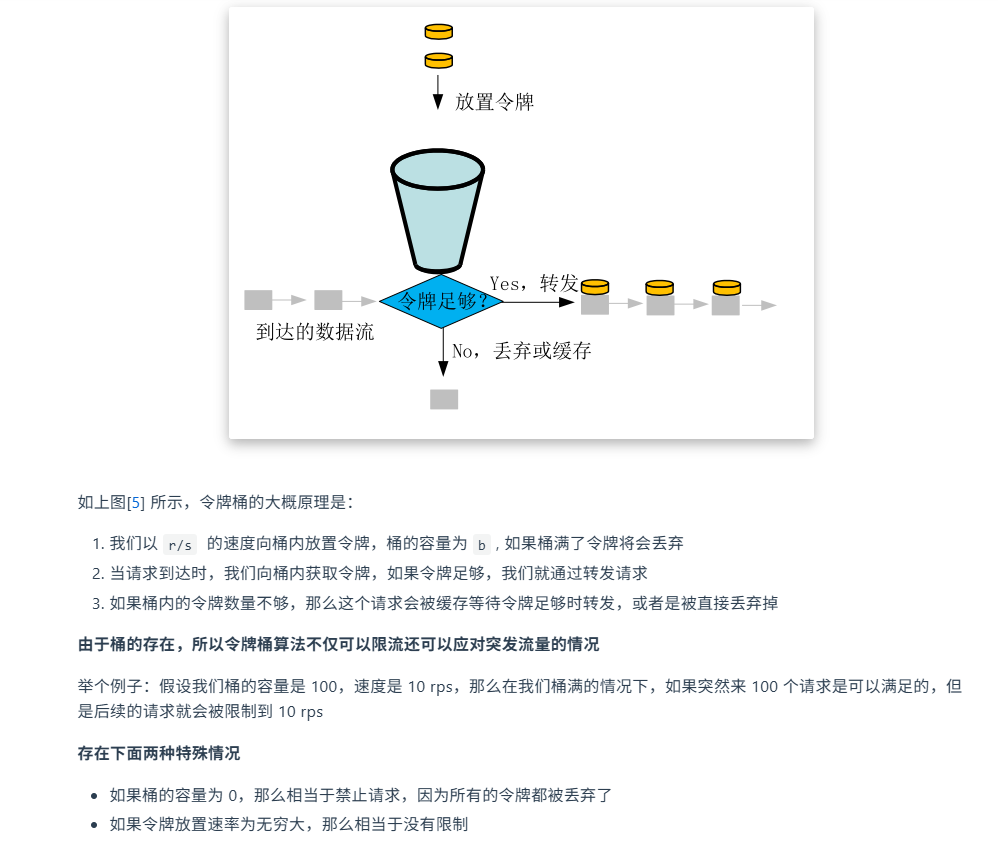
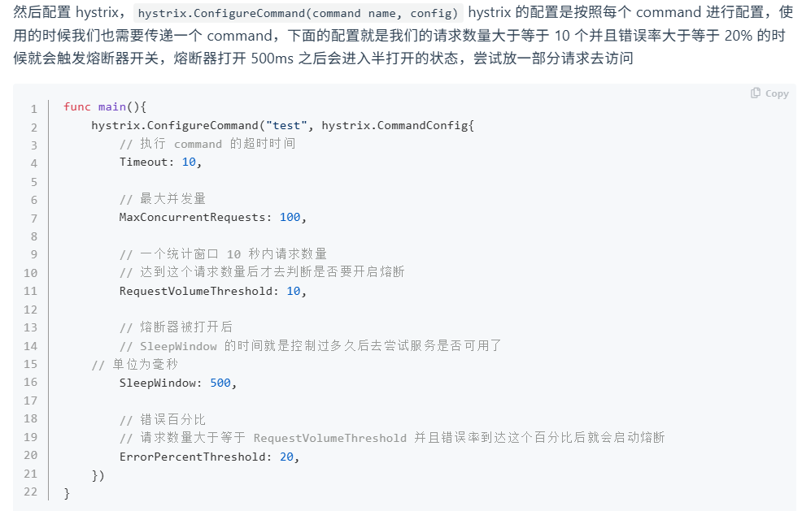
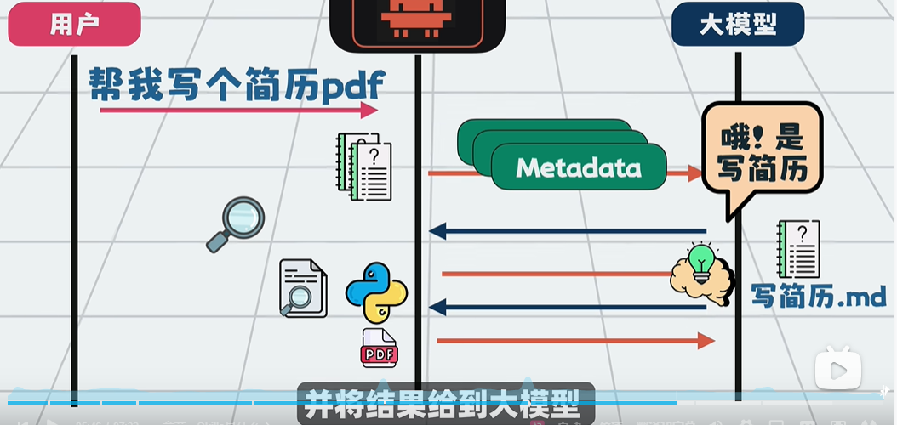
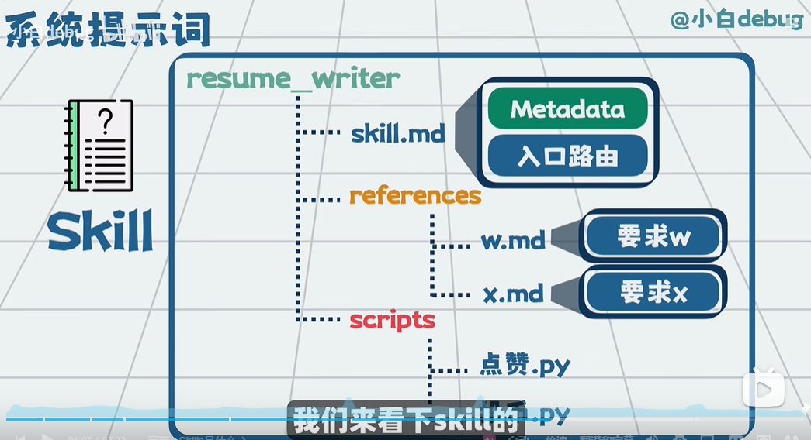
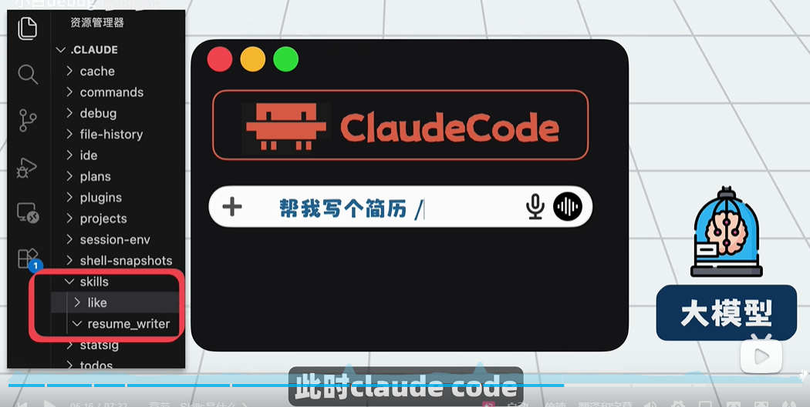

# 微服务

## 一、限流

### 1. 固定计数

### 2.滑动窗口

### 3.令牌桶

### 4.漏桶

## 二、熔断

Hystrix 的"三态"熔断机制：**关闭 → 打开 → 半开 → 关闭。**

时间窗口t内，限流最大并发量，若请求数超过n时熔断生效，若失败率超过r熔断打开，等待t1后尝试进入半打开状态。

## 三、降级

# AI
## 一、Claude Code

