# 微服务

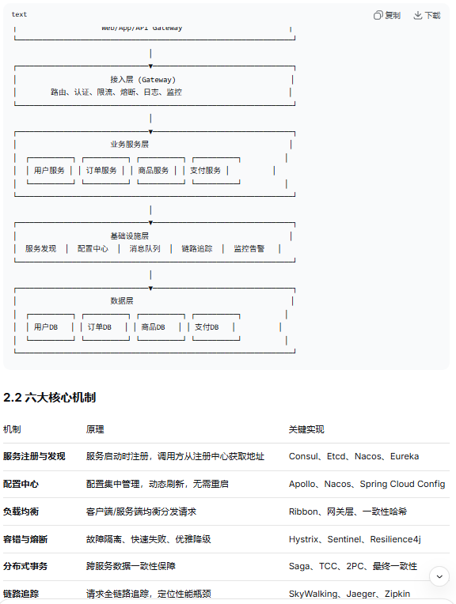

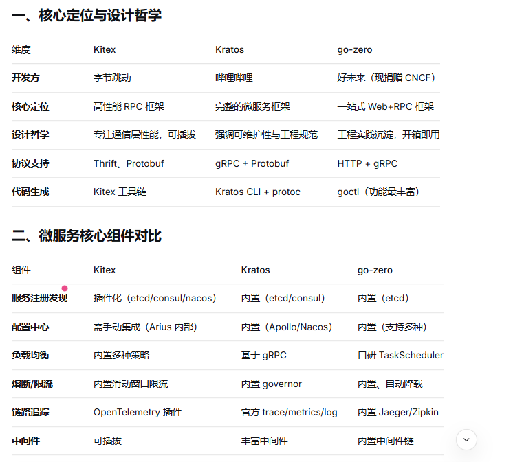


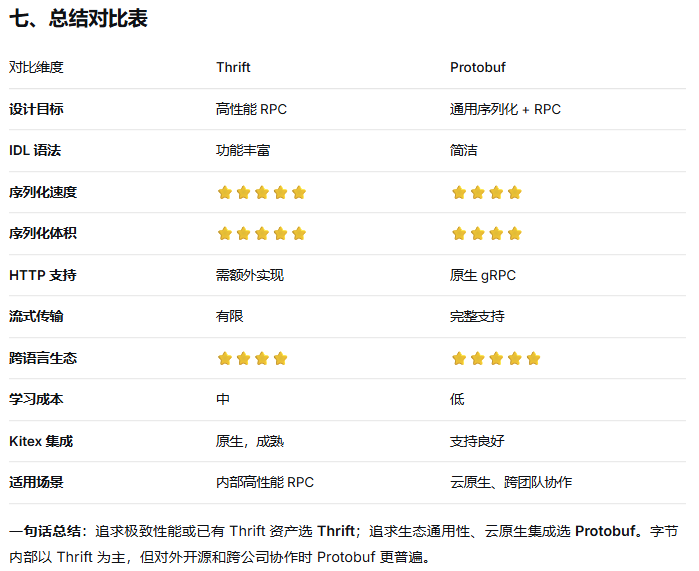

## 一、限流

### 1. 固定计数

### 2.滑动窗口

### 3.令牌桶


### 4.漏桶

## 二、熔断

Hystrix 的"三态"熔断机制：**关闭 → 打开 → 半开 → 关闭。**

时间窗口t内，限流最大并发量，若请求数超过n时熔断生效，若失败率超过r熔断打开，等待t1后尝试进入半打开状态。


## 三、降级

**转入到降级页面**

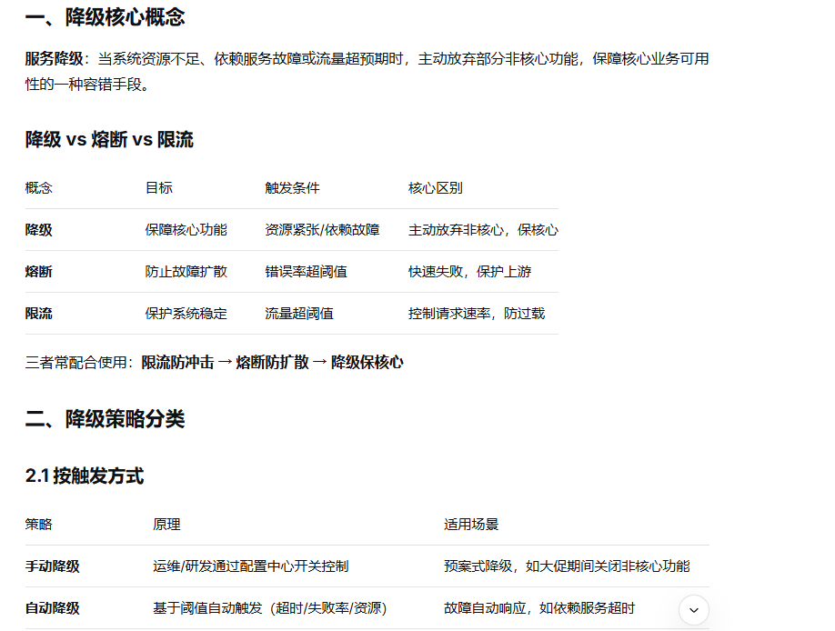

## 四、链路追踪

## 五、分层拆分

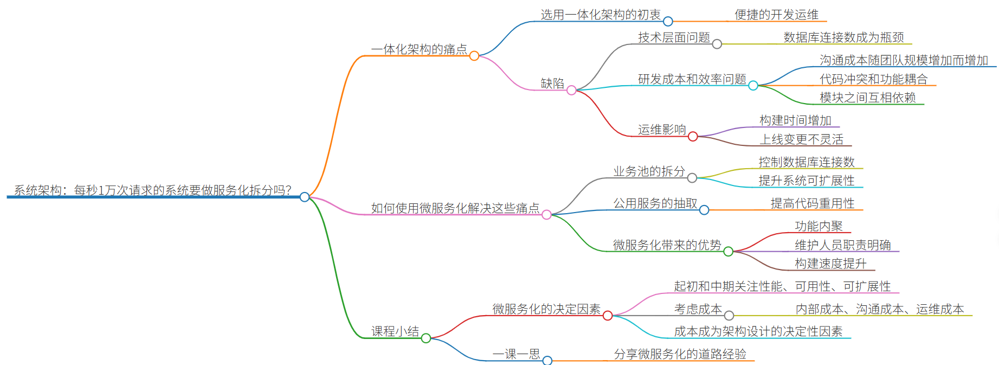

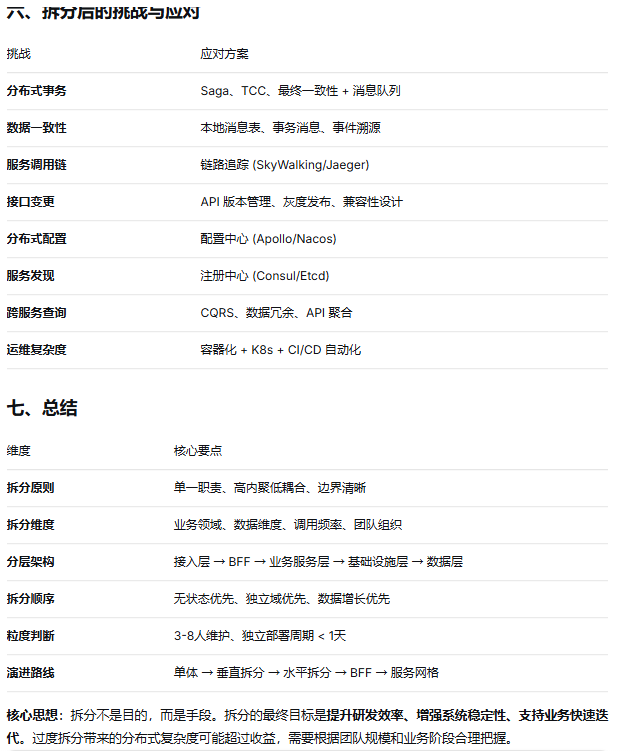

## 六、注册发现

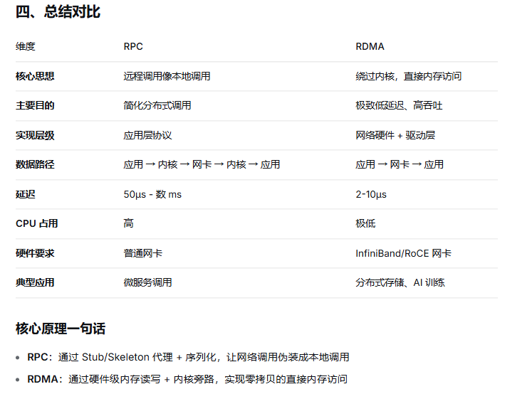

## 七、配置中心

## 八、对比Spring

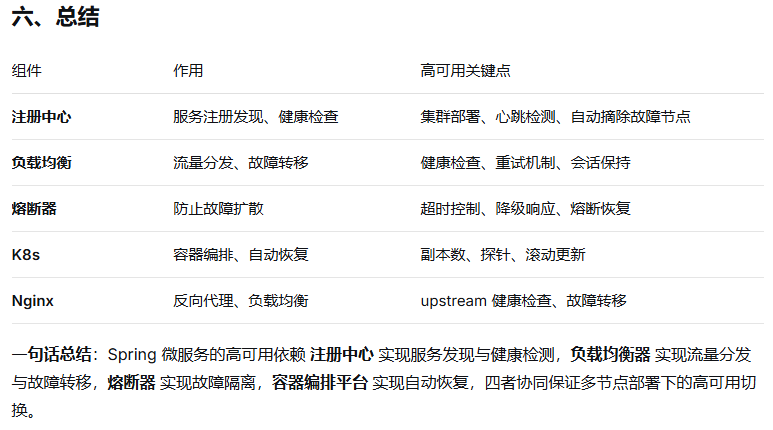

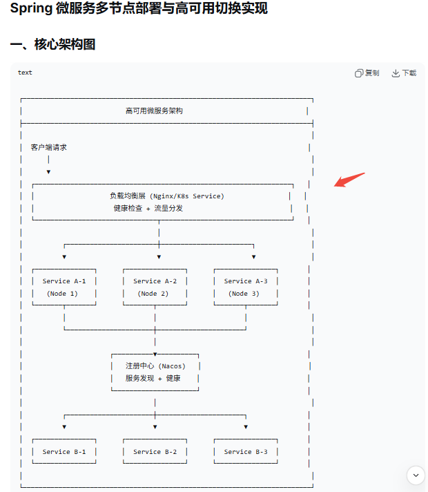

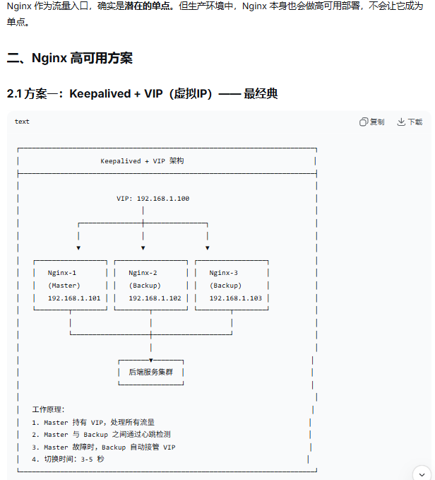

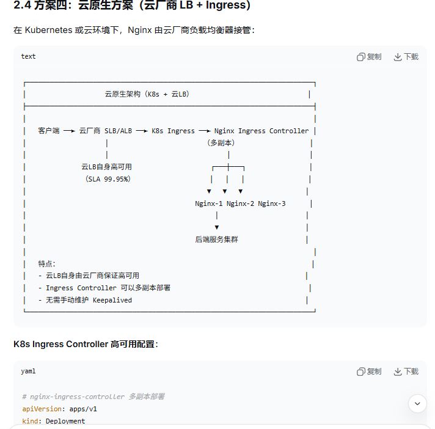

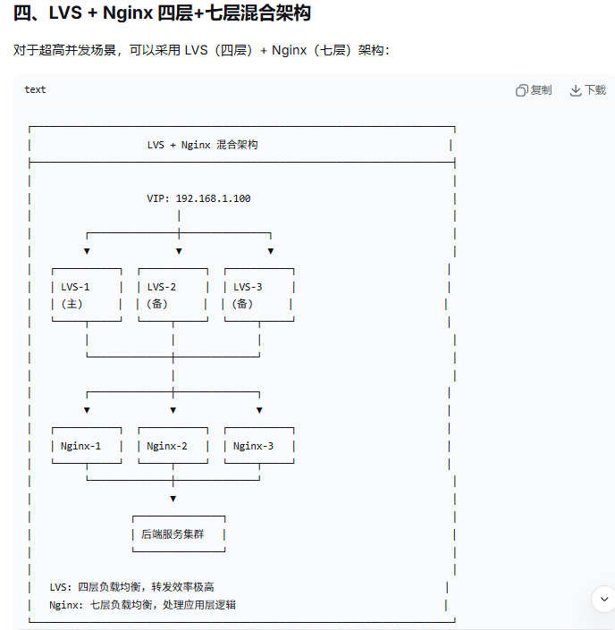

各方案对比

| 方案                       | 切换时间         | 成本     | 复杂度 | 适用场景               |
| -------------------------- | ---------------- | -------- | ------ | ---------------------- |
| **Keepalived + VIP** | 3-5秒            | 低       | 中等   | 传统IDC、自建机房      |
| **DNS 轮询**         | 依赖TTL (分钟级) | 极低     | 简单   | 非关键业务、容错要求低 |
| **硬件负载均衡**     | 秒级             | 高       | 低     | 大型企业、金融行业     |
| **云LB + K8s**       | 秒级             | 按量付费 | 低     | 云原生环境             |
| **LVS + Nginx**      | 秒级             | 低       | 较高   | 高性能大流量场景       |

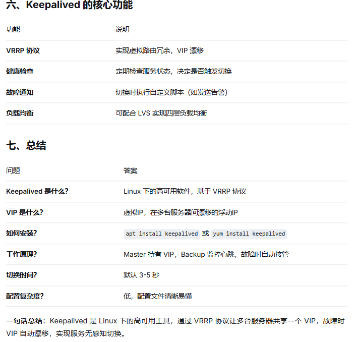

# 分布式系统

## 原理

**分布式系统的核心本质，就是通过“无共享架构”打破单机物理极限，并在“网络不可靠、节点会故障”的客观现实下，用共识算法、数据冗余、任务调度等机制，将复杂的分布式问题封装起来，最终向上层应用提供一个“像单机一样简单，但规模和可用性远超单机”的计算平台。**解决单机无法解决的三大问题：** 容量、算力和可用性。**

**1.数据库事务的** ACID

2.CAP三个特性：一致性（consistency）、可用性（Availability）、分区容错（partition-tolerance）都需要的情景. CAP定律说的是在一个分布式计算机系统中，一致性，可用性和分区容错性这三种保证无法同时得到满足，最多满足两个。**一致性中还包括强一致性、弱一致性、最终一致性等级别****

3.**BASE是** **Basically Available(基本可用）** **、** **Soft state(软状态）** **和** **Eventually consistent(最终一致性）** **三个短语的简写.**其核心思想是即使无法做到强一致性，但每个应用都可以根据自身的业务特点，采用适当的方法来使系统达到** **最终一致性** **。****

**高可用性的衡量标准如下：**

| **可用性分类**                   | **可用水平（%）** | **一年中可容忍停机时间** |
| -------------------------------------- | ----------------------- | ------------------------------ |
| **容错可用性**                   | **99.9999**       | **<1 min**               |
| **极高可用性**                   | **99.999**        | **<5 min**               |
| **具有故障自动恢复能力的可用性** | **99.99**         | **<53 min**              |
| **高可用性**                     | **99.9**          | **<8.8h**                |
| **商品可用性**                   | **99**            | **<43.8 min**            |

## Raft（共识算法）

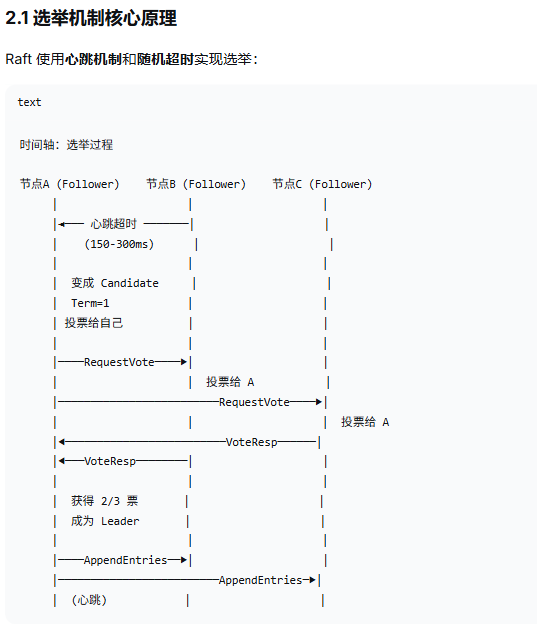

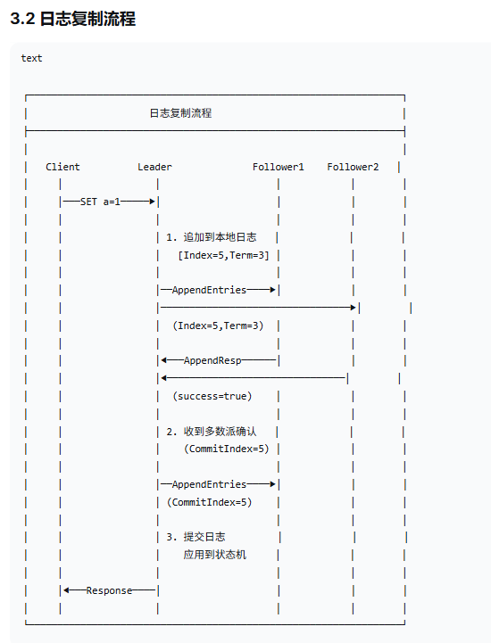

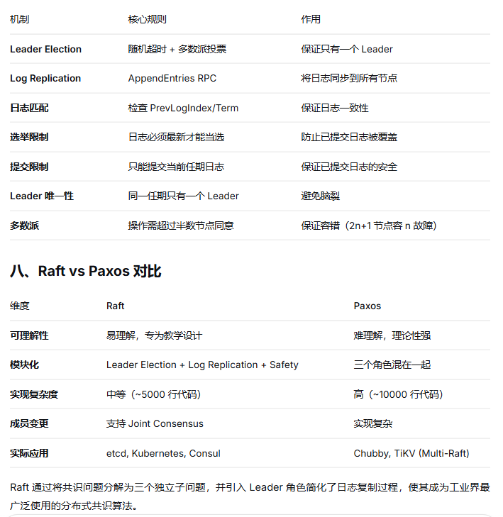

## 一致性哈希

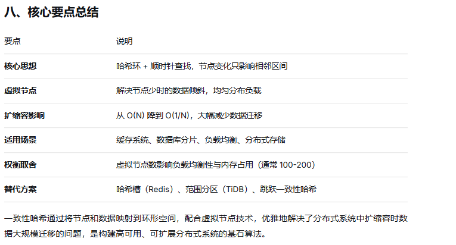

## ASM冗余、重平衡

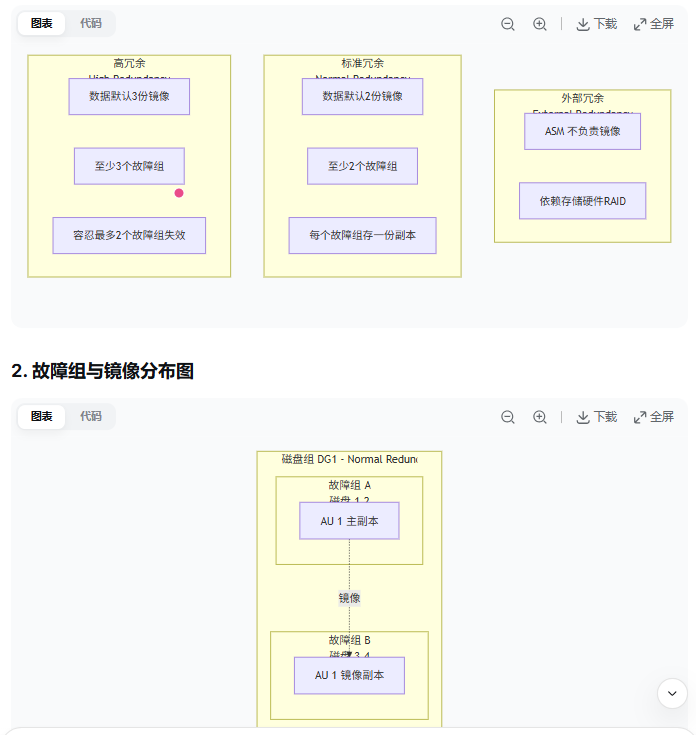

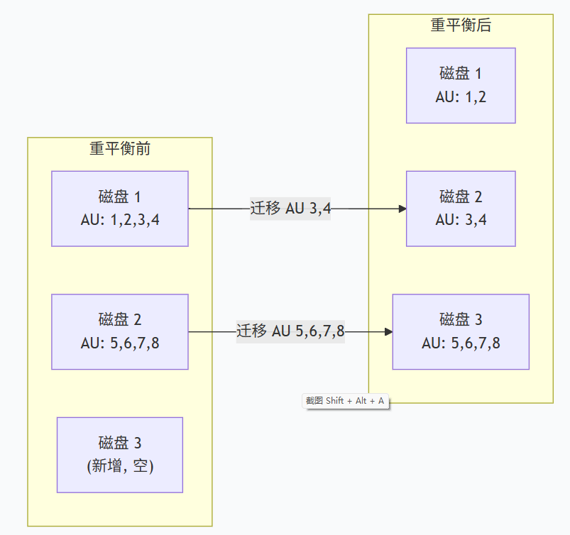

## RDAM

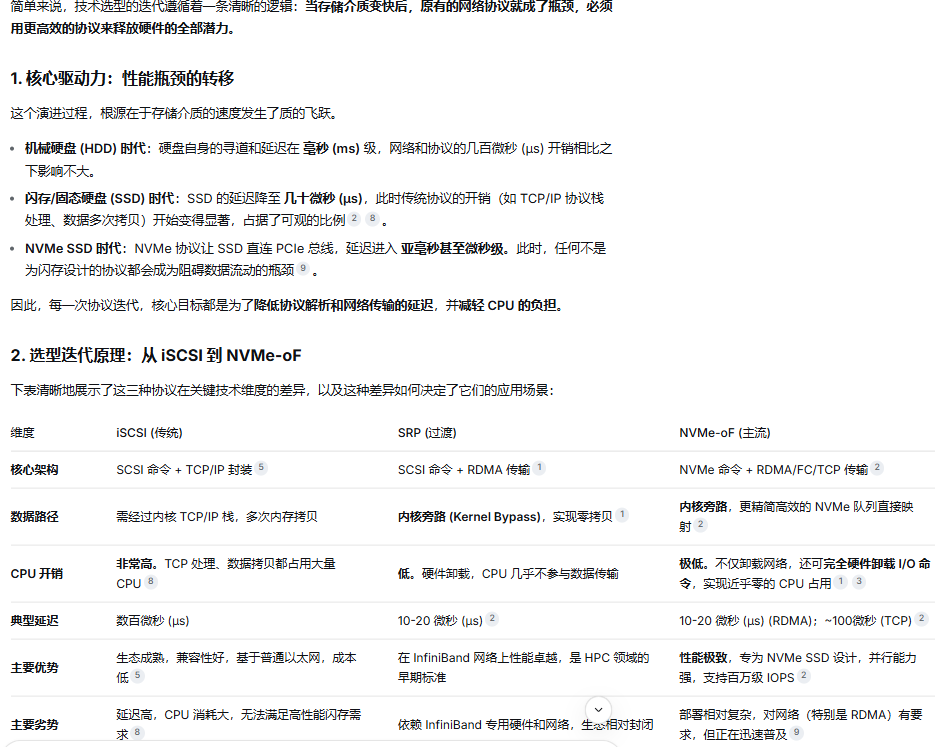

# 高并发系统

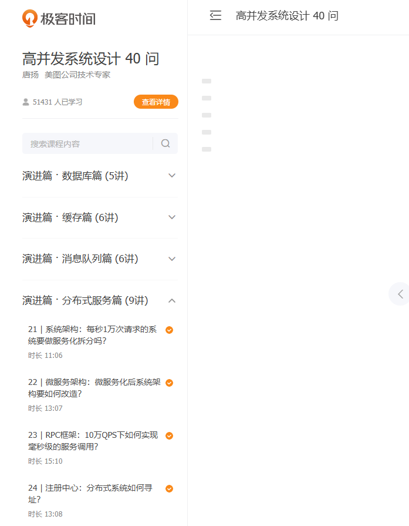

## 数据库

5.1 分库分表决策原则

**text**

```
数据量 < 500万 → 单库单表
数据量 500万-5000万 → 分表不分库
数据量 > 5000万 或 TPS > 1000 → 分库分表
```

5.2 避坑指南

| 避坑点                   | 说明                                 |
| ------------------------ | ------------------------------------ |
| **分片键不可变**   | 分片键一旦确定，不应修改             |
| **提前规划分片数** | 建议初始分片数为 2 的幂次，便于扩容  |
| **避免跨分片事务** | 业务设计时尽量将相关数据落在同一分片 |
| **监控分片倾斜**   | 定期检查各分片数据量是否均匀         |
| **分片数不宜过多** | 过多分片增加运维复杂度               |

5.3 总结表

| 问题       | 核心方案                   |
| ---------- | -------------------------- |
| 分布式 ID  | 雪花算法、号段模式         |
| 跨分片查询 | 冗余存储、映射表、广播查询 |
| 分布式事务 | TCC、Saga、最终一致性      |
| 扩容       | 一致性哈希、双写迁移       |
| 全局唯一性 | 分布式锁 + 唯一性校验服务  |
| DDL 变更   | 批量执行 + 灰度平台        |

 **一句话总结** ：分库分表解决了数据库单点瓶颈，但引入了分布式复杂性。 **优先考虑数据库优化（索引、SQL 重构、读写分离），分库分表是最后手段** 。

## 缓存

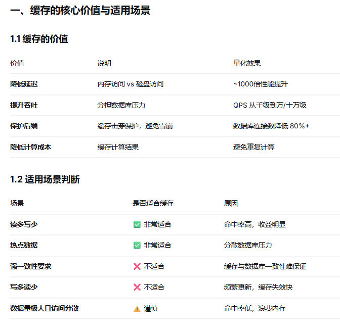

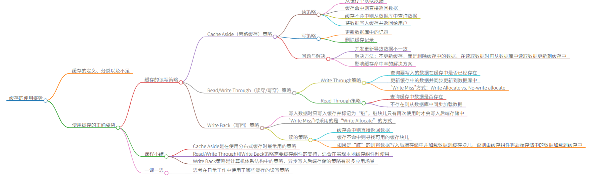

## 队列

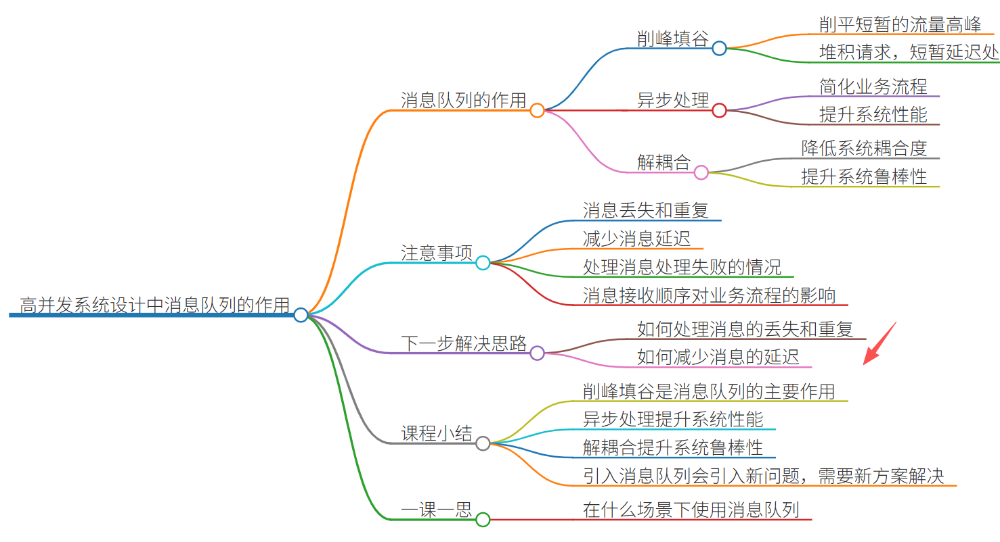

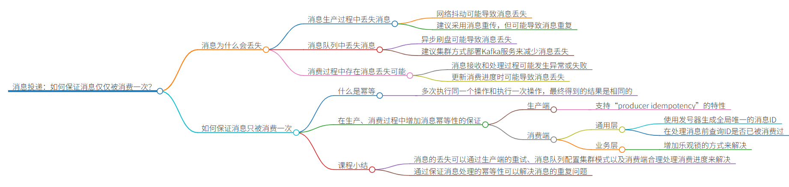

## 分布式场景

# 云原生

## 架构

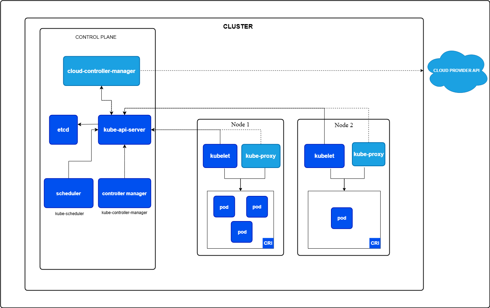

**Kubernetes的核心架构是“以API Server为中心的星型通信模型”，所有组件通过API Server与etcd交互，通过Watch机制实现实时响应，通过控制器循环不断调谐至期望状态。这种设计实现了控制平面与数据平面的解耦，赋予了集群强大的自愈能力和可扩展性。API Server是所有组件的唯一入口，其他组件通过Watch机制与它交互，实现了松耦合.**

声明式 API，才是 Kubernetes 项目编排能力“赖以生存”的核心所在，Kubernetes 项目才可以基于对 API 对象的增、删、改、查，在完全无需外界干预的情况下，完成对“实际状态”和“期望状态”的调谐（Reconcile）过程。

如何理解“Kubernetes 编程范式”，如何为 Kubernetes 添加自定义 API 对象，编写自定义控制器，正是这个晋级过程中的关键点

调谐与 Watch 的核心机制对比

| 机制             | 方向               | 触发方式         | 用途                   |
| ---------------- | ------------------ | ---------------- | ---------------------- |
| **Watch**  | API Server → 组件 | 长连接推送       | 实时感知资源变化       |
| **List**   | 组件 → API Server | 启动时拉取       | 初始化本地缓存         |
| **调谐**   | 组件 → API Server | 周期性或事件驱动 | 使实际状态趋近期望状态 |
| **Update** | 组件 → API Server | 调谐后更新       | 上报状态、修改资源     |

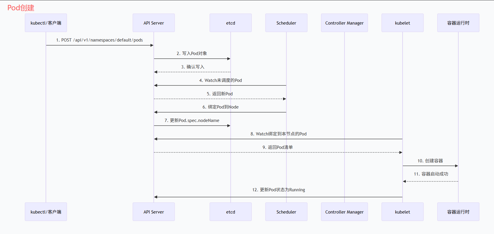

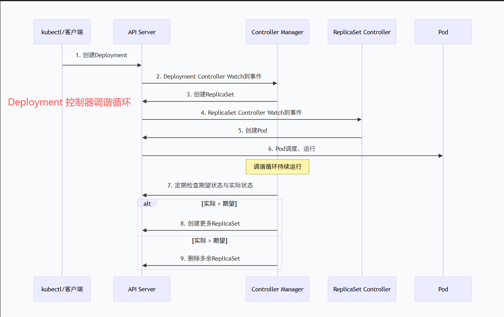

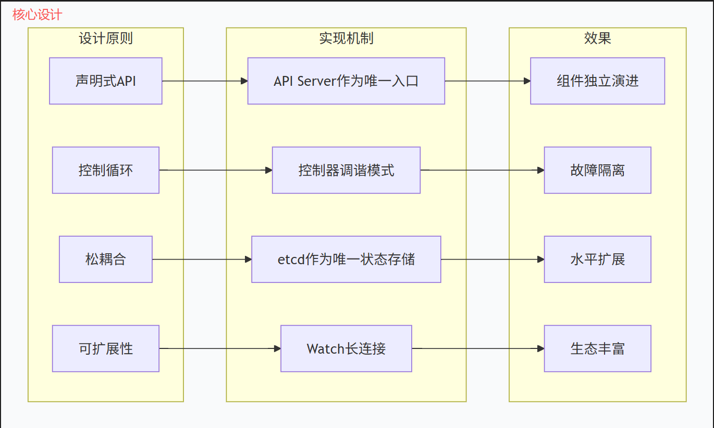

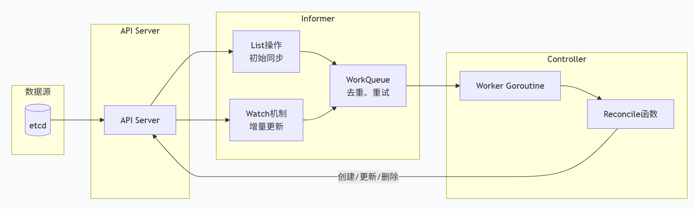

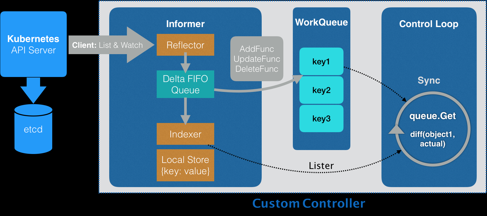

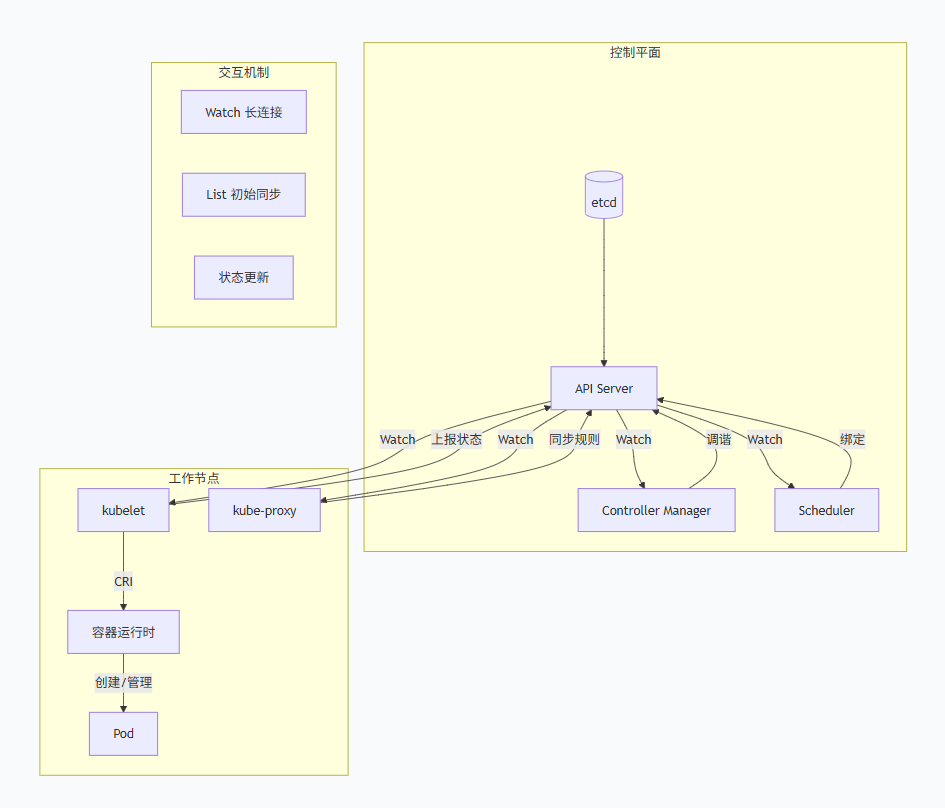

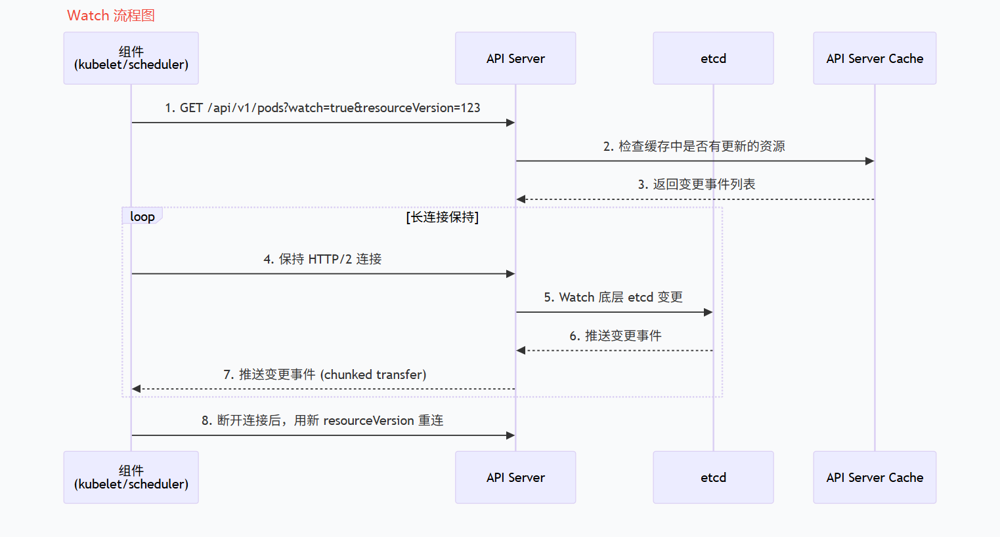

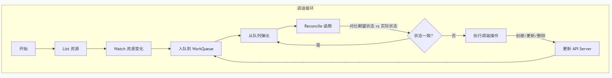

## 问题

### 1. Scheduler 的调度流程是怎样的？预选和优选分别有哪些策略？

调度流程：

1. 从队列取Pod
2. 预选：过滤不满足条件的Node（如资源不足、端口冲突、节点亲和性等）
3. 优选：对剩余Node打分（资源均衡、亲和性、镜像本地性等）
4. 选最高分Node，将绑定信息写回API Server

常用预选策略：

- PodFitsResources：检查CPU/内存是否足够
- PodFitsHost：检查是否指定节点名
- PodFitsHostPorts：检查端口是否冲突
- MatchNodeSelector：检查节点标签是否匹配

常用优选策略：

- LeastRequestedPriority：优先选择资源使用率低的节点
- BalancedResourceAllocation：优先选择资源分配均衡的节点
- NodeAffinityPriority：节点亲和性匹配

### 2. 调谐链路的核心源码

Kubernetes 的调谐机制本质上是**事件驱动 + 控制循环**的经典实现，核心代码集中在 `k8s.io/client-go` 和 `k8s.io/kubernetes/pkg/controller` 中.

 **调谐链路的源码核心是 "Reflector + DeltaFIFO + Indexer + WorkQueue + Worker" 的五层架构** ：

1. **Reflector** ：通过 ListAndWatch 从 API Server 获取资源变更
2. **DeltaFIFO** ：存储事件队列，保证顺序处理
3. **Indexer** ：本地缓存，减少 API 调用
4. **Informer** ：事件分发器，连接数据源和处理器
5. **WorkQueue** ：限速队列，支持去重和重试
6. **Worker** ：并发执行 Reconcile 调谐逻辑

这种设计实现了**事件驱动 + 最终一致性**的调谐模型，是 Kubernetes 自愈能力的核心保障。

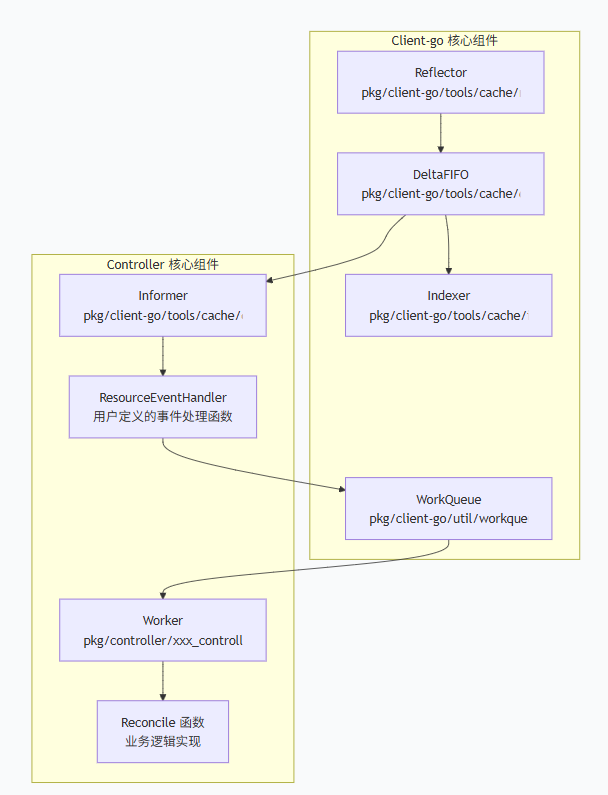

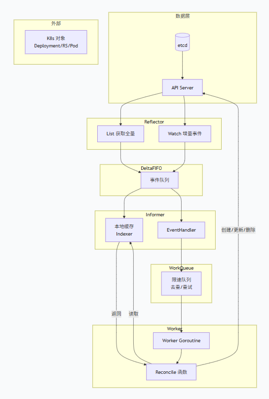

### 3.**Watch 链路的核心源码**

 **Watch 链路的核心是 "HTTP/2 流式响应 + resourceVersion 断点续传 + etcd gRPC Stream" 三层流式传输** ：

1. **Client 侧** ：Reflector 通过 RESTClient 发起 Watch 请求，通过 Decoder 解析 JSON 事件流
2. **API Server 侧** ：WatchHandler 建立流式响应，调用底层 Storage 的 Watch 方法
3. **Storage 层** ：etcd3 存储通过 etcd 客户端建立 gRPC 流，将 etcd 事件转换为 K8s Watch 事件

这种设计实现了**实时、可靠、可续传**的资源变更通知机制，是 Kubernetes 声明式 API 和调谐循环的底层支撑。

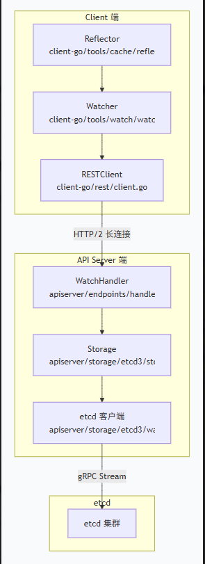

### 4.workqueue调用reconcile处源码

```go
// sigs.k8s.io/controller-runtime/pkg/internal/controller/controller.go
func (c *Controller) processNextWorkItem(ctx context.Context) bool {
    // 1. 从队列中获取一个 Request（阻塞直到有任务）
    obj, shutdown := c.Queue.Get()
    if shutdown {
        return false  // 队列关闭，worker 退出
    }

    // 2. 将 Request 转换为 NamespacedName
    req := obj.(reconcile.Request)
  
    // 3. 调用 reconcileHandler 执行调谐
    defer c.Queue.Done(req)  // 确保标记处理完成
  
    // 执行调谐并获取结果
    result, err := c.reconcileHandler(ctx, req)
  
    // 4. 根据结果处理 requeue 逻辑
    if err != nil {
        // 错误情况：限速重试
        c.Queue.AddRateLimited(req)
        return true
    }
  
    if result.RequeueAfter > 0 {
        // 延迟重试：指定时间后重新入队
        c.Queue.AddAfter(req, result.RequeueAfter)
        return true
    }
  
    if result.Requeue {
        // 立即重试：限速重试
        c.Queue.AddRateLimited(req)
        return true
    }
  
    // 成功处理完成：从限速记录中删除
    c.Queue.Forget(req)
    return true
}
```

完整调用链路图

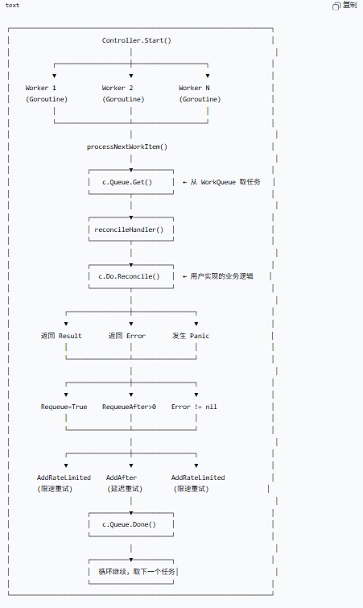

### 5.queue阻塞有任务到才调谐，任务是如何产生触发的

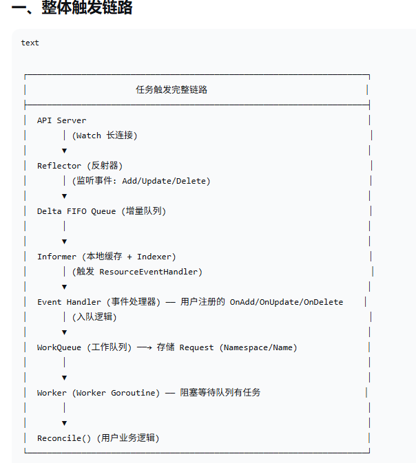

```go


Informer 的事件处理器注册
在 controller-runtime 中，当调用 SetupWithManager 时，框架会自动为监听的资源创建 Informer 并注册事件处理器：

go
// sigs.k8s.io/controller-runtime/pkg/builder/controller.go
func (blder *Builder) Build() (controller.Controller, error) {
    // ...
  
    // 为 For() 指定的资源创建 Informer 并注册事件处理器
    src := &source.Kind{Type: blder.forInput.object}
  
    // 调用 Watch 方法，将事件源与控制器关联
    err = blder.ctrl.Watch(src, &handler.EnqueueRequestForObject{})
  
    // ...
}

Informer 到 EventHandler 的完整链路
3.1 Reflector 监听 API Server
go
// k8s.io/client-go/tools/cache/reflector.go
func (r *Reflector) ListAndWatch(stopCh <-chan struct{}) error {
    // 1. 初始 List 获取全量资源
    list, err := r.listerWatcher.List(options)
  
    // 2. 将全量资源添加到 Delta FIFO
    r.syncWith(list, r.resourceVersion)
  
    // 3. 启动 Watch 长连接
    watcher, err := r.listerWatcher.Watch(options)
  
    // 4. 循环处理 Watch 事件
    for {
        event, ok := <-watcher.ResultChan()
        switch event.Type {
        case watch.Added:
            r.store.Add(event.Object)
        case watch.Modified:
            r.store.Update(event.Object)
        case watch.Deleted:
            r.store.Delete(event.Object)
        }
    }
}
3.2 Delta FIFO 到 Informer 的处理
go
// k8s.io/client-go/tools/cache/controller.go
func (c *controller) Run(stopCh <-chan struct{}) {
    // 启动 Reflector
    go c.reflector.Run(stopCh)
  
    // 启动处理循环
    go c.processLoop()
}

func (c *controller) processLoop() {
    for {
        // 从 Delta FIFO 弹出对象
        obj, err := c.config.Queue.Pop(PopProcessFunc(c.config.Process))
  
        // 调用 Informer 的 Process 函数
        c.config.Process(obj)
    }
}
3.3 SharedInformer 的事件分发
go
// k8s.io/client-go/tools/cache/shared_informer.go
func (s *sharedIndexInformer) HandleDeltas(obj interface{}) error {
    for _, d := range obj.(Deltas) {
        switch d.Type {
        case Added, Updated:
            // 更新本地缓存
            s.indexer.Update(d.Object)
  
            // 通知所有注册的事件处理器
            for _, handler := range s.processors.listeners {
                handler.add(d.Object)
            }
        case Deleted:
            s.indexer.Delete(d.Object)
            for _, handler := range s.processors.listeners {
                handler.delete(d.Object)
            }
        }
    }
    return nil
}
```

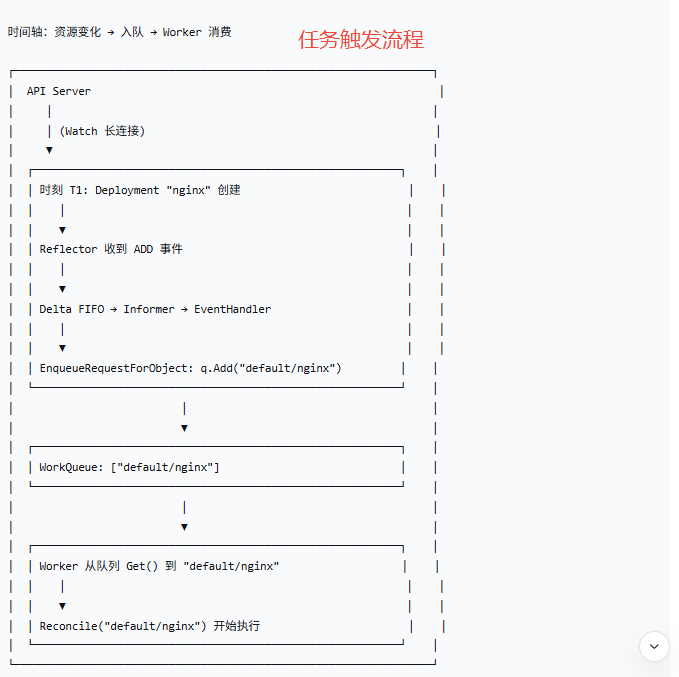

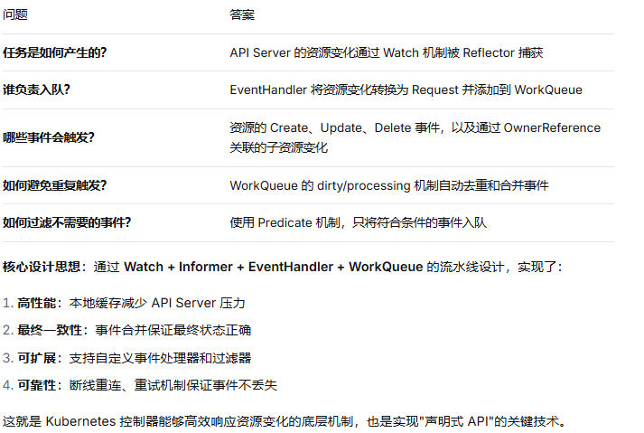

## 微服务对比

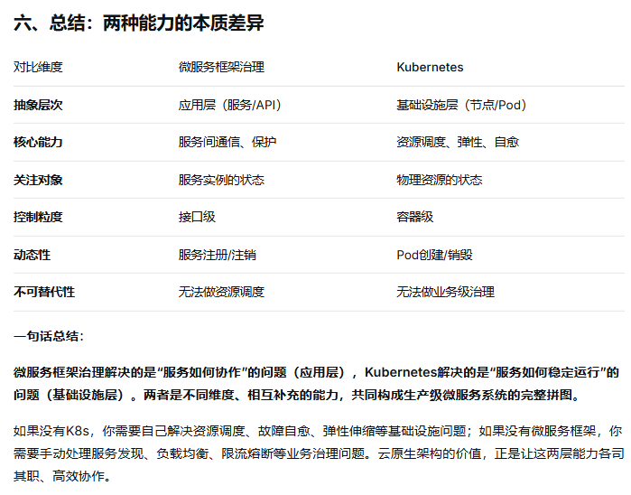

## 发展路径

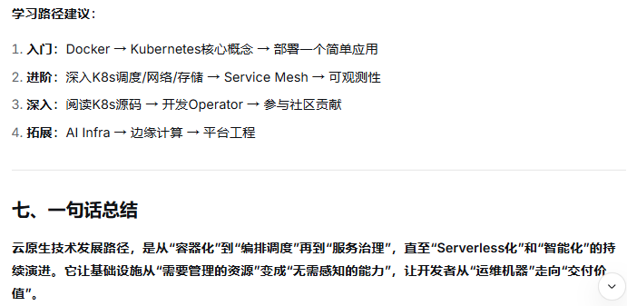

## 官方库

https://github.com/kubernetes/kubernetes

https://github.com/kubernetes/client-go

https://github.com/kubernetes-sigs/controller-runtime

## Operator

Operator 的工作原理，实际上是利用了 Kubernetes 的自定义 API 资源（CRD），来描述我们想要部署的“有状态应用”；然后在自定义控制器里，根据自定义 API 对象的变化，来完成具体的部署和运维工作

┌─────────────────────────────────────────────────────────┐
│                    Operator 架构                         │
├─────────────────────────────────────────────────────────┤
│  CRD (Custom Resource Definition)                       │
│    ↓                                                     │
│  Informer (监听资源变化)                                 │
│    ↓                                                     │
│  WorkQueue (事件队列)                                    │
│    ↓                                                     │
│  Reconciler (调谐循环)                                   │
│    ↓                                                     │
│  Client (操作 Kubernetes API)                           │
└─────────────────────────────────────────────────────────┘

## CSI

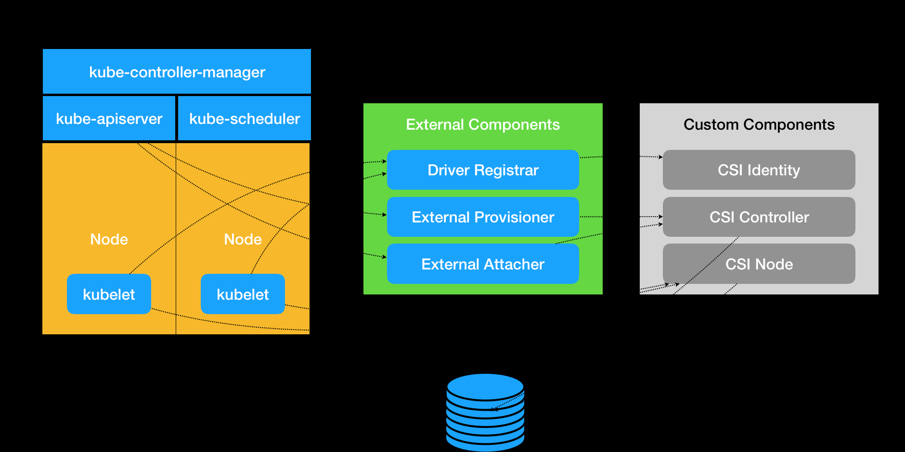

# AI

## 一、Claude Code

cr_dd16f4dcbdc764589d4066c9aa869ceba9c26cc41ee85a517a4558da6f2bae55 程
cr_2bca7702d59cb8f5382939a880895f29964947f512419df6d617083943920b60 罗

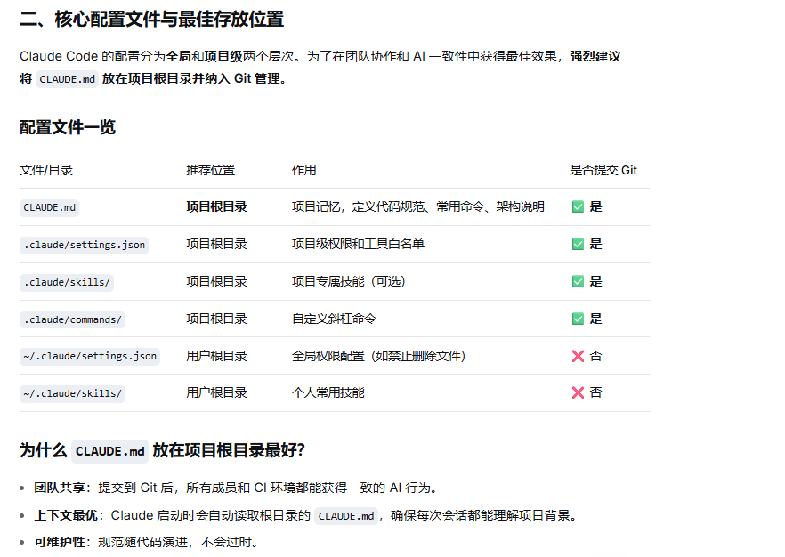


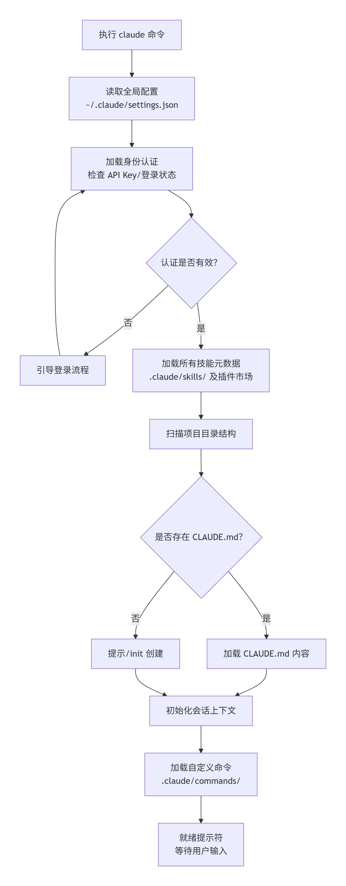

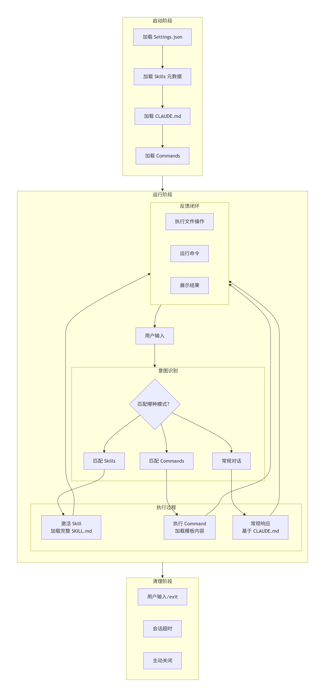

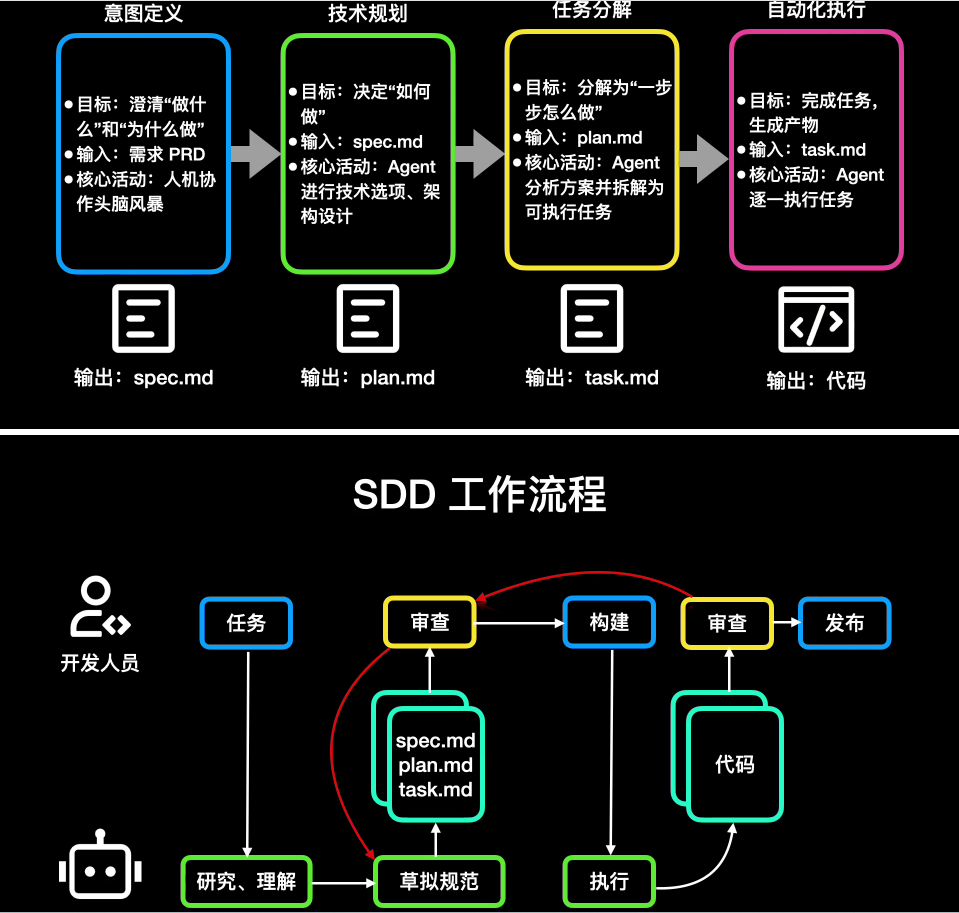

#### a.项目架构

/init 生成.claude/CLAUDE.MD。包含项目核心架构图、核心业务及源码链路及核心命令、打包部署、优秀设计点、核心技术栈等。多用UML图表示

我需要快速熟悉这个 Golang 微服务项目，请帮我分析：

1. **项目概览**

   - 目录结构和模块划分
   - 技术栈和版本
   - 服务定位和职责
2. **接口定义**

   - IDL 文件位置和内容
   - 定义的 service 和 method
   - 请求/响应结构
3. **服务治理**

   - 服务注册发现方式
   - 负载均衡策略
   - 超时、重试、熔断配置
4. **核心业务流程**

   - 主要业务功能
   - 请求处理链路
   - 关键代码路径
5. **数据层设计**

   - 数据库表结构
   - 缓存设计
   - 数据访问层实现
6. **外部依赖**

   - 调用的其他服务
   - 中间件依赖
   - 配置管理方式
7. **部署运维**

   - 启动方式
   - 配置环境区分
   - 日志和监控

#### b. 分任务

分任务工作流模板

6.1 新功能开发工作流

**text**

```
1. [计划] 使用 Plan Mode 制定功能实现步骤
   ↓
2. [确认] 审查并确认计划
   ↓
3. [分步] 按 Phase 1 → Phase N 执行
   ↓
4. [验证] 每步完成后运行测试
   ↓
5. [检查点] 关键节点保存 checkpoint
   ↓
6. [回滚] 出现问题时回退到最近检查点
   ↓
7. [完成] 最终验证和代码审查
```

6.2 Bug 修复工作流

1. [复现] 确认 bug 复现步骤
   ↓
2. [定位] 找到问题代码位置
   ↓
3. [方案] 提出修复方案
   ↓
4. [修复] 最小化修改
   ↓
5. [验证] 添加测试用例
   ↓
6. [回归] 运行全量测试

6.3 代码重构工作流

1. [分析] 识别需要重构的代码区域
   ↓
2. [测试] 确保现有测试覆盖
   ↓
3. [小改] 每次只改动一个模块
   ↓
4. [保持] 确保测试持续通过
   ↓
5. [检查点] 每个模块重构后保存
   ↓
6. [清理] 删除废弃代码
   ↓
7. [文档] 更新相关文档

请按照以上维度逐一分析，并提供关键代码文件路径。

# Clean Arch

## 原理

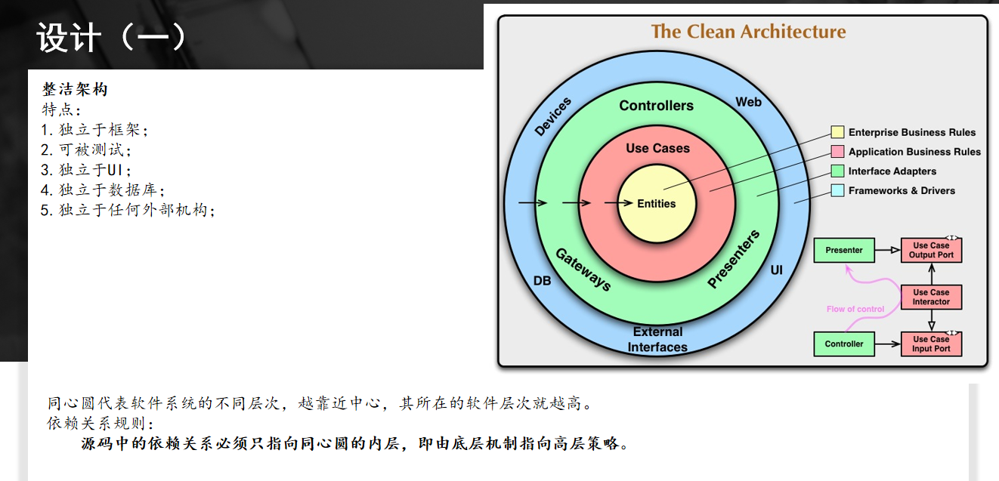

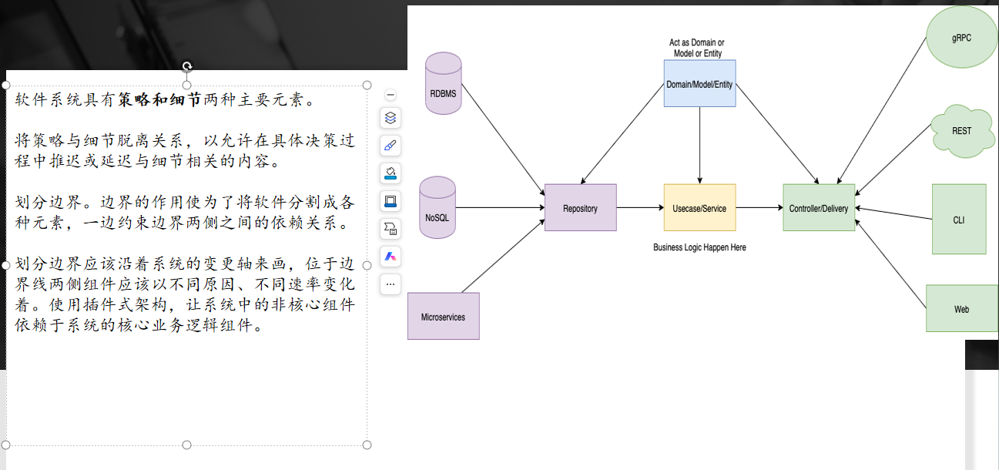

## SOLID原则

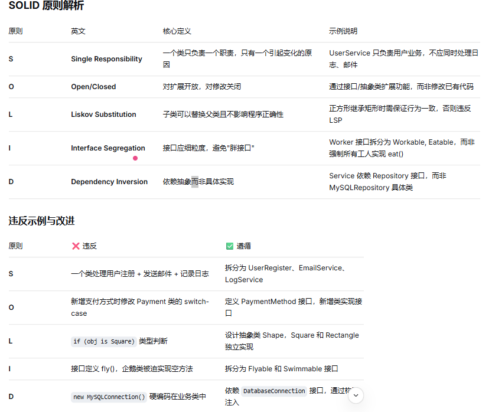

## 设计模式

面向对象设计模式分类

### 一、三大分类概览

| 分类             | 核心目的    | 代表模式             | 一句话说明                 |
| ---------------- | ----------- | -------------------- | -------------------------- |
| **创建型** | 对象创建    | 工厂、单例、建造者   | 解耦对象实例化过程         |
| **结构型** | 类/对象组合 | 适配器、代理、装饰器 | 组合类或对象形成更大结构   |
| **行为型** | 对象交互    | 策略、观察者、责任链 | 管理对象间的通信和职责分配 |

### 二、创建型模式 (Creational)

关注对象创建机制，使系统独立于对象的创建、组合和表示。

| 模式               | 核心思想             | 场景举例                   |
| ------------------ | -------------------- | -------------------------- |
| **单例**     | 全局唯一实例         | 配置管理、数据库连接池     |
| **工厂方法** | 子类决定实例化哪个类 | 日志记录器（文件/数据库）  |
| **抽象工厂** | 创建一系列相关对象   | UI 组件库（Win/Mac 风格）  |
| **建造者**   | 分步构建复杂对象     | SQL 查询构造器、DTO 构建   |
| **原型**     | 克隆对象而非 new     | 大对象复制、避免昂贵初始化 |

### 三、结构型模式 (Structural)

关注如何将类或对象组合成更大的结构，同时保持结构灵活高效。

| 模式             | 核心思想                    | 场景举例                     |
| ---------------- | --------------------------- | ---------------------------- |
| **适配器** | 接口转换，兼容不匹配的接口  | 第三方库接入、旧系统兼容     |
| **装饰器** | 动态添加职责，比继承灵活    | 中间件、日志增强、权限包装   |
| **代理**   | 控制对象访问                | 延迟加载、访问控制、远程代理 |
| **外观**   | 提供统一简化接口            | 复杂子系统封装（如编译系统） |
| **组合**   | 树形结构，统一处理叶子/容器 | 文件系统、组织架构           |
| **桥接**   | 抽象与实现分离，独立变化    | 跨平台绘图（形状 × 颜色）   |
| **享元**   | 共享细粒度对象，节省内存    | 连接池、字符串常量池         |

### 四、行为型模式 (Behavioral)

关注对象间的职责分配和通信方式。

| 模式               | 核心思想                   | 场景举例                       |
| ------------------ | -------------------------- | ------------------------------ |
| **策略**     | 算法可互换，独立于客户端   | 支付方式、排序算法、压缩算法   |
| **观察者**   | 一对多依赖，状态变更通知   | 事件驱动、消息队列、响应式编程 |
| **责任链**   | 请求沿链传递，直到被处理   | 中间件、审批流程、过滤器       |
| **模板方法** | 定义算法骨架，子类实现步骤 | 数据导入（解析→处理→导出）   |
| **命令**     | 请求封装为对象             | 任务队列、撤销重做、事务       |
| **状态**     | 状态变化改变对象行为       | 订单状态机、工作流             |
| **迭代器**   | 统一遍历集合               | 集合遍历、数据库游标           |
| **访问者**   | 分离操作与对象结构         | AST 遍历、报表导出             |
| **中介者**   | 对象间通信解耦             | 聊天室、调度中心               |
| **备忘录**   | 捕获恢复对象状态           | 保存快照、撤销操作             |
| **解释器**   | 定义文法规则               | SQL 解析、正则表达式           |

# Face

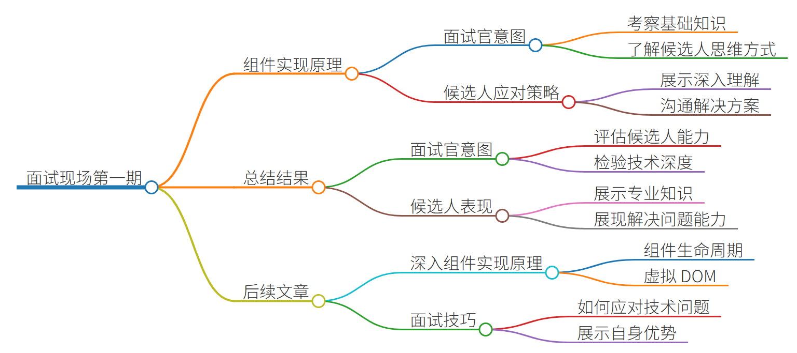

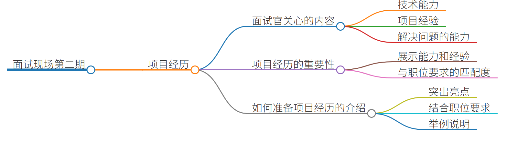
